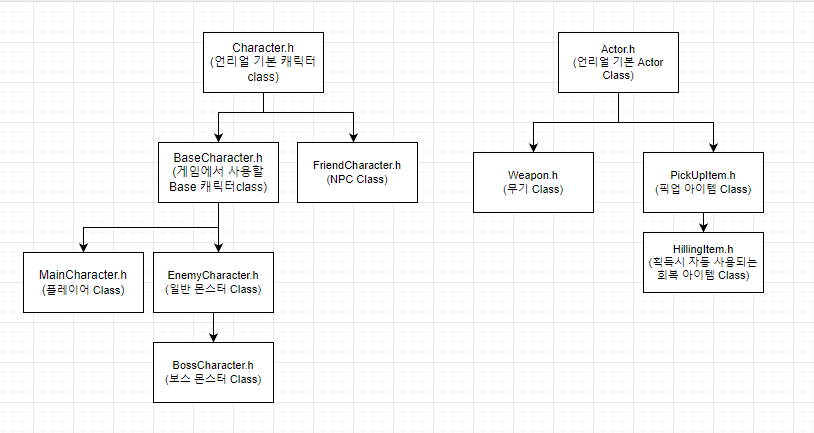
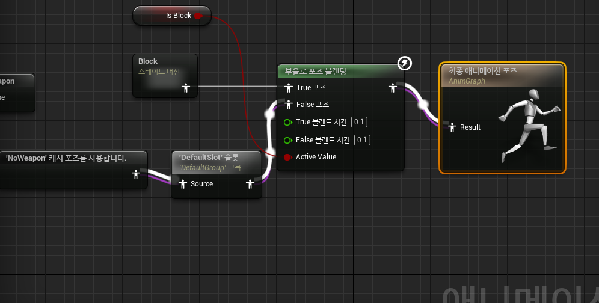
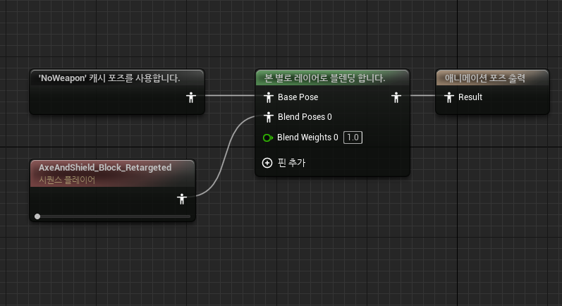
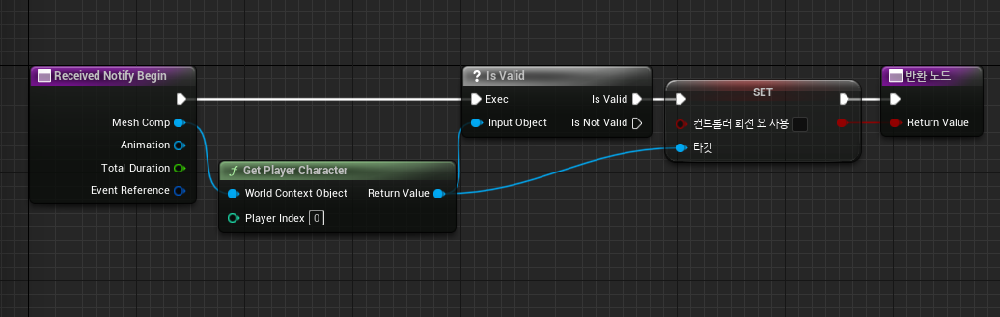
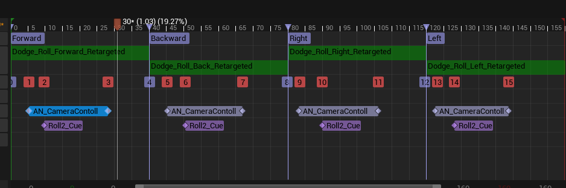
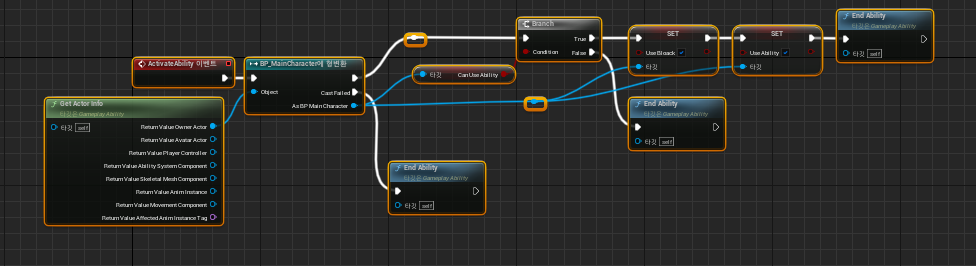
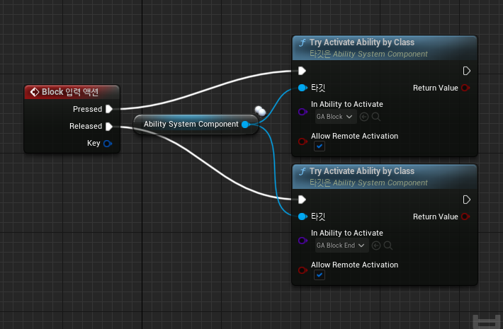

# MakeGame

# 졸업 작품 및 포트폴리오 정리

## 목차
+ ### [1.게임 설명](#게임-설명)
+ ### [2.클래스 구조](#클래스-구조)
+ ### [3.개발 요약](#개발-요약)
+ ### [4.개발 사항](#개발-및-작성-사항)

## 주차별 개발 사항

## 게임 설명
+ ### 모티브: God Of War & Sekiro
+ ### God Of War: 공격 및 피격, 스킬사용 등에서 오는 짜릿한 타격감을 구현 할 예정
+ ### Sekiro: 패링위주의 전투를 구상해볼 예정
+ ### 장르: 액션RPG
+ ### 제작툴 및 언어: 언리얼엔진5 & C++
+ ### 한 줄 설명: 스테이지를 진행하면서 보스를 잡고 무기의 및 새로운 기술을 해금 하여 스태이지를 진행 그후 최종 보스를 잡는 형식의 게임

## 클래스 구조

### 클래스 상속


## 개발 요약

### 12/26 ~ 12/30 

+ ### 12/26 작성 및 Github 작성
+ ### 12/27 메인 캐릭터 기능 및 요소 구상
+ ### 12/28 일반 몬스터 기능 및 요소 구상
+ ### 12/29 보스 몬스터 기능 및 요소 구상 && Udemy 강좌 정리
+ ### 12/30 무기 기능 및 요소 구상

### 01/02 ~ 01/08

+ ### 01/02 아이템 클래스 구상 및 무기클래스 
+ ### 01/03 ~ 01/04 메인캐릭터 이동 및 시점 구현
+ ### 01/06 ~ 01/08 개발 중지 및 프로잭트 재생성

### 01/09 ~ 01/17

+ ### 01/09 ~ 01/10 캐릭터 이동 재 구현
+ ### 01/11 ~ 01/12 캐릭터 회피 구현
+ ### 01/13 캐릭터 회피 개선 및 클래스 구조 개선
+ ### 01/16 캐릭터에 방패 부착
+ ### 01/17 Udemy 강좌 정리 && 방어 애니메이션 구현

### 01/18 ~ 01/24 설 연휴 및 건강 회복

### 01/25 ~ 01/27

+ ### 01/25 무기 장착 구현
+ ### 01/26~01/27 검 장착시 작동될 애니메이션 구현

### 01/30 ~ 02/03
+ ### 01/30 검 장착 로직 및 애니메이션 개선
+ ### 02/01 ~ 02/02 검 공격 애니메이션 구현
+ ### 02/03 검 공격 로직 개선

### 02/06 ~ 02/08
+ ### 02/06 공격 로직 추가 개선 및 무기와의 연동 구현
+ ### 02/08 스킬 사용 구현

### 02/14 ~ 02/17
+ ### 02/14 RPGHitComponent(충돌 시스템) 제작
+ ### 02/16 스킬에 충돌 시스템 적용
+ ### 02/17 공격 이펙트,사운드 및 피격 이펙트 적용

### 02/20 ~ 02/28
+ ### 현장실습 마무리 주간 및 발표

### 03/01 ~ 03/05 개강 준비 및 인한 휴식

### 03/06 ~ 03/10
+ ### 03/06 프로젝트 및 현장실습  정리
+ ### 03/07 스킬 시스템 개선
+ ### 03/08 ~ 03/09 프로젝트에GameplayAbilitySystem 적용
+ ### 03/10 이동, 달리기, 회피 재구현

### 03/13 ~ 03/17
+ ### 03/13 방어 재구현
---


## 개발 및 작성 사항

### 1.메인 캐릭터 (12/27)
#### --------------------------요소---------------------------
+ #### 현재 상태(이동, 방어, 공격, 스킬 사용, etc…..)
+ #### HP(생명력)
+ #### EP(속성력 -> 공격 or 패링시 상승, 꽉 차면 특수 스킬 사용)
+ #### 스킬 쿨 타임(Q, E 각 스킬마다 다른 쿨 타임 가짐)
+ #### ES(강화 재료)
#### --------------------------기능----------------------------
+ #### W(앞), A(좌), S(뒤), D(우)
+ #### 왼쪽Shift(대쉬)
+ #### 왼쪽마우스 클릭(공격 -> 연속으로 클릭하면 콤보 공격 가능)
+ #### 오른쪽마우스 클릭(방어 & 패링)
+ #### 숫자1, 2(무기 변경 키)
+ #### 왼쪽Ctrl(특수 사용)
+ #### 스페이스바(회피)
+ #### Q, E(일반 스킬)
+ #### R(회복 포션 사용)
+ #### I(정비창)
+ #### F(상호 작용)


### 2.일반 몬스터(12/28)
#### --------------------------요소---------------------------
+ #### 현재 상태(이동, 공격, 사망, etc…..)
+ #### HP(생명력)
+ #### StackEP(속성력 누적치-> 플레이어의 공격에 피격 시 or 플레이어가 패링 성공 시 상승)
+ #### SturnTime(기절 시간)
+ #### Type(몬스터의 종류, 속성이나 근or원거리 등등)
#### --------------------------기능----------------------------
+ #### AI(공격, 대기, 플레이어에게 이동, etc…….)
+ #### 아이템드롭(회복 포션 or 강화 재료)

### 3-1.보스 몬스터 : 일반몬스터(상속) (12/29)
#### --------------------------요소---------------------------
+ #### 현재 상태(이동, 공격, 사망, etc…..)
+ #### HP(생명력)
+ #### StackEP(속성력 누적치-> 플레이어의 공격에 피격 시 or 플레이어가 패링 성공 시 상승)
+ #### SturnTime(기절 시간)
+ #### Type(몬스터의 종류, 속성이나 근or원거리 등등)
+ #### EP(특수 패턴용 속성치, 플레이어에게 피격or 공격 시 증가)
+ #### Pase(보스 페이즈 남은 HP 따라 변경)
#### --------------------------기능----------------------------
+ #### AI(공격, 대기, 플레이어에게 이동, etc…….)
+ #### 아이템드롭(회복 포션 or 강화 재료)

### 3-2.Udemy 강좌 정리

#### 강좌 명: Unreal Engine 5 C++ Developer: Learn C++ & Make Video Games

#### 챕터: HealthComponent

내용 정리: 여태까지 플레이어 캐릭터, 적캐릭터 등, HP를 가지고 있는 경우 해당 클래스에서 구현하여 클래스가 길어 졌는데, 해당 강좌에서 설명해준 ActorComponent를 상속 받아
HealthComponent를 C++로 작성하고 각 객체에 추가하여 프로젝트를 제작하는 방법을 습득, 이번에 만드는 게임에서도 사용해볼 예정

사용 법: HealthComponent를 개량하여 현제 제작할 게임에 맞게 변경 -> HP뿐만아니라 EP(속성치)나, 기절 시간 등 전투에 사용될 공통 부분을 제어할 CombetComponent를 작성 하도록 함.
```cpp
TakeDamage(AActor* DamagedActor, float Damage, const UDamageType* DamgeType, AController* Instigator, AActor* DamageCauser)

DamagedActor: 데미지를 받는 액터

Damage: 받은 데미지

DamgeType: 데미지 타입 (후에 필요한 타입을 정리하여, 추가 해볼 예정)

Instigator: 데미지를 준 객체의 컨트롤러

DamageCauser: 데미지를 준 객체
```

해당 함수를 사용하는 것도 좋아보임 고려해볼것

### 4.PickUpItem (01/02)
#### --------------------------기능---------------------------
+ ### PickUp(특정 거리에 플레이어가 오면 상호작용 키가 보이며 해당키를 누르면 PickUp)

### 5.무기 (01/02)
#### --------------------------요소---------------------------
+ #### Skill(무기에 장착된 스킬, 2개)
+ #### ESkill(속성치가 다 차면 사용 가능한 스킬)
+ #### Damage(공격력)
#### --------------------------기능---------------------------
+ #### 콜리전On/Off(공격 시작 시 콜리전On 종료 시 Off)
+ #### 무기 해금 기능(PickUp시 호출 -> 무기 해금)

### 6.자동사용 아이템 : PickUpItem (01/02)
#### --------------------------요소---------------------------
+ #### HealingType(HP-체력 or EP-속성력)
+ #### HealingAmount(회복량)
#### --------------------------기능---------------------------
+ #### 회복(PickUp 시 자동으로 호출-> Type에 따라서 체력(HP) or 속성력(EP) 회복)

---

### 1.캐릭터 이동 및 시점 구현

+ #### 이동 방식: W, S, A, D키를 이용하여 앞, 뒤, 좌, 우 방향으로 이동 하도록 구현

```cpp
void AMainCharacter::SetupPlayerInputComponent(UInputComponent* PlayerInputComponent)
{
	Super::SetupPlayerInputComponent(PlayerInputComponent);

	PlayerInputComponent->BindAxis("Move Forward", this, &AMainCharacter::MoveForward); 	//앞, 뒤 이동
	PlayerInputComponent->BindAxis("Move Right", this, &AMainCharacter::MoveRight);		//좌, 우 이동
	PlayerInputComponent->BindAxis("Turn Right", this, &AMainCharacter::AddControllerYawInput); //시점 좌, 우
	PlayerInputComponent->BindAxis("Turn Up", this, &AMainCharacter::AddControllerPitchInput);  //시점 상, 하
}
void AMainCharacter::MoveForward(float Value) //앞,뒤 이동 뒤로 이동할시 이동속도 감소
{
	if (Value < 0.0f)
	{
		GetCharacterMovement()->MaxWalkSpeed = BackworadWalkSpeed;
	}
	else
	{
		GetCharacterMovement()->MaxWalkSpeed = ForwardWalkSpeed;
	}
	AddMovementInput(GetActorForwardVector() * Value);

}

void AMainCharacter::MoveRight(float Value) //좌, 우 이동
{
	AddMovementInput(GetActorRightVector() * Value);
}

```

+ #### 주요 함수

```cpp
AddMovementInput(FVector) // 해당 백터의 방향으로 움직임 줌
AddControllerPitchInput() // Pitch 방향으로 회전 줌
AddControllerYawInput() //Yaw 방향으로 회전 줌
PlayerInputComponent->BindAxis("이벤트 이름", this, Function) // 축 입력 이벤트에 대하여 해당 함수를 Bind함
GetActorForwardVector() // Actor의 앞방향 벡터를 반환
GetActorRightVector() // Actor의 오른쪽 방향 백터를 반환
```

---

### 프로젝트 중단 및 재 생성

+ #### 문제1: 현제 사용할려는 애니메이션과 캐릭터 에셋간의 스켈레톤 구조가 매우 다름, 리타겟팅을 써도 사용 불가, 새로운 캐릭터 에셋 및 애니메이션을 사용 해야 함,
+ #### 문제2: 현제 프로젝트의 폴더 정리가 매우 난잡하고 파일의 크기가 매우 커짐

### 해결

+ #### 사용할려는 애니메이션에 제일 비슷한 구조를 가진 pragon에셋을 사용하도록 결정, 프로젝트 정리 및 파일 크기 압축을 위해 애니메이션 작업용 프로젝트를 따로 만들어 애니 메이션을 먼져 작업후 본 프로젝트에 추가하여 작업을 진행 함

### 캐릭터 이동 재구현

+ #### 이동 방식: W, S, A, D키를 이용하여 앞, 뒤, 좌, 우 방향으로 이동 하도록 구현

```cpp
void AMainCharacter::MoveForward(float Value)
{
	if (Value > 0)
	{
		GetCharacterMovement()->MaxWalkSpeed = CurrentSpeed;
	}
	else if (Value < 0)
	{
		GetCharacterMovement()->MaxWalkSpeed = CurrentSpeed - BackwardSpeed;
	}

	if ((Controller != nullptr) && (Value != 0.0f))
	{
		// find out which way is forward
		const FRotator Rotation = Controller->GetControlRotation();
		const FRotator YawRotation(0, Rotation.Yaw, 0);

		// get forward vector
		const FVector Direction = FRotationMatrix(YawRotation).GetUnitAxis(EAxis::X);
		AddMovementInput(Direction, Value);
	}
}
```
#### 설명: 이동방향 맡게 이동 시키며 후방 이동 시 BackwardSpeed 만큼 이동속도를 감소 시킴

+ #### 대쉬: LShift 키를 누르고 있으면 대쉬를 하도록 구현

```cpp
void AMainCharacter::Dash()
{
	if (!bUseDash)
	{
		bUseDash = true;
		CurrentSpeed = ForwardRunSpeed;
	}
}

void AMainCharacter::DashEnd()
{
	if (bUseDash)
	{
		bUseDash = false;
		CurrentSpeed = ForwardWalkSpeed;
	}
}
```
#### 설명: 키 입력을 받아 Shift키가 눌리면 이동속도를 ForwardRunSpeed(뛰기 속도)로 변경하고 눌리지 않았을 경우 ForwardWalkSpeed 걷기 속도로 변경 함

### 캐릭터 회피 구현

+ ### MainCharacter.h

```cpp
UENUM()
enum class MainState : uint8
{
	MS_Move UMETA(DisplayName = "Move"),
	MS_Dodge UMETA(DisplayName = "Dodge"),

	MS_Max
};
UCLASS()
class MYGAME_API AMainCharacter : public ABaseCharacter
{
private:
	UPROPERTY(VisibleAnywhere, BlueprintReadOnly, Category = Combet, meta = (AllowPrivateAccess = "true"))
	int32 MoveNum = 1; // W, S, A, D 키 입력에 따라 변하여 회피하는 방향을 결정함

	class UMainAnimInstance* MainAnimInstance; // 캐릭터의 애니메이션 변수

	UPROPERTY(VisibleAnywhere, BlueprintReadOnly, Category = Combet, meta = (AllowPrivateAccess = "true"))
	MainState State; //캐릭터 상태Enum
	
	void Dodge() //회피 실행 함수
public:
	void DodgeEnd(); // 회피 종료 함수, 애니메이션의 AnimNotify에 의해 자동으로 호출되어 실행 됨
}
```
+ ### MainCharacter.cpp
```cpp
void AMainCharacter::MoveForward(float Value)
{
	'''
	if (Value >= 0)
	{
		MoveNum = 1;
	}
	else if (Value < 0)
	{
		MoveNum = 2;
	}
}

void AMainCharacter::MoveRight(float Value)
{
	'''
	if (Value > 0)
	{
		MoveNum = 3;
	}
	else if (Value < 0)
	{
		MoveNum = 4;
	}
}
void AMainCharacter::Dodge()
{
	State = MainState::MS_Dodge; // 현재 상태를 Dodge로 변경 -> 이동은 Move 상태임으로 이동 불가 상태가 됨
	MainAnimInstance->PlayDodge(MoveNum); //MainAnimInstance.cpp에 회피 애니메이션 실행 함수 호출
}

void AMainCharacter::DodgeEnd()
{
	State = MainState::MS_Move; // 현재 상태를 Move로 변경
}
```

#### 설명: 현재 이동할려는 방향과 스페이스키를 누르면 해당 방향에 맞는 회피 모션이 나오도록 구현함 

#### 문제점: 회피하면서 카메라 시점을 회전하면 캐릭터도 그에 맞게 회전됨 -> 후에 Idle 상태를 추가하여 이동 입력이 들어오면 Move로 바꾸고 이때에만 카메라 시점이 회전하면 캐릭터가 회전 하도록 수정 해볼 것

### 회피 개선 
+ #### 1차 개선: Enum에 Idle 상태를 추가하여 Move(이동), Dodge(회피), Idle(대기)3가지의 상태를 만들어 각각 해당하는 입력에 따라 캐릭터의 bUseRotatuonYaw값을 수정 하도록 설계
#### -> 문제점: 회피는 BindAction이고 움직임은 BindAxis라 서로 작동 방식이 미세하게 다름, 따라서 움직임키에 BindAction할 이벤트를 새로 작성하여 구현, Move -> Dodge -> Idel의 상태 변화에는 성공 하였음, 그러나 회피후 이동 키를 다시 한번 눌러야 하는 점이나, 사선 이동 -> 직선 이동으로 변경시 이동이 끊기는 상황이 생겨, 해당 안은 폐기함

+ #### 2차 개선: Enum에 따로 추가하지않고 기본상태를 Move로 , 회피 시에만 Dodge상태로 바꾸며 이때 직접적으로, bUseRotatuonYaw값을 수정하여 회피시에 카메라 회전에 따라 캐릭터의 이동을 막음 -> 생각한 이동 방식 적합하다고 판단하여 해당 방식으로 구현함

### 클래스 개선
+ #### MainCharacter.h에 있던 ENum을 MainState에서 MoveState로 이름을 변경, BaseCharacter.h로 위치를 이동
#### -> 이유: 후에 몬스터도 해당 ENum을 사용하여 상태를 조절 할 예정, 따로 추가하는 것보단 같은 부모 클래스에 작성하는 것이 효율적이라고 판단.

### 캐릭터에 방패 부착

+ #### 캐릭터의 왼쪽 팔에다가 ArmShield를 부착함, 장착한 무기에 상관없이 방패는 고정되는 형태로 후에 입력에 따른 방어 애니메이션을 추가할 예정

#### Shield.h
```cpp

class MYGAME_API AShield : public AActor
{
	GENERATED_BODY()
	
public:	
	// Sets default values for this actor's properties
	AShield();
private:
	UPROPERTY(VisibleAnywhere)
	USceneComponent* Root; //root컴포넌트

	UPROPERTY(VisibleAnywhere, BlueprintReadOnly, Category = Mesh, meta = (AllowPrivateAccess = "true"))
	UStaticMeshComponent* Mesh; //메시
};
```
#### Shield.cpp

```cpp

AShield::AShield()
{
 	// Set this actor to call Tick() every frame.  You can turn this off to improve performance if you don't need it.
	PrimaryActorTick.bCanEverTick = true;
	Root = CreateDefaultSubobject<USceneComponent>(TEXT("Root")); //root 컴포넌트 설정
	SetRootComponent(Root);

	Mesh = CreateDefaultSubobject<UStaticMeshComponent>("Messh"); //Mesh설정
	Mesh->SetupAttachment(Root);
}

#### MainCharacter.h
```cpp
UCLASS()
class MYGAME_API AMainCharacter : public ABaseCharacter
{
private:
	UPROPERTY(EditDefaultsOnly, BlueprintReadOnly, Category = Combet, meta = (AllowPrivateAccess = "true")) 
	TSubclassOf<AShield> ShieldClass;	// 블루프린트에서 설정할 방패

	UPROPERTY()
	AShield* Shield; //실제로 c++내에서 컨트롤 하는 방패
}
```
#### MainCharacter.cpp

```cpp

void AMainCharacter::BeginPlay()
{
	'''
	
	Shield = GetWorld()->SpawnActor<AShield>(ShieldClass); //방패 엑터를 월드상에 스폰
	Shield->AttachToComponent(GetMesh(), FAttachmentTransformRules::KeepRelativeTransform, TEXT("ShieldSocket")); // 스폰한 방패를 "ShieldSocket" 란 이름을 가진소켓 에 부착
	Shield->SetOwner(this);
}
```

### Udemy 강좌 정리

#### 강좌 명: Unreal Engine 5 C++ Developer: Learn C++ & Make Video Games :: SimpleShooter 

#### 강의 정리: AI 기초 설정 및 시점 조절 함수를 배움

```cpp 

SetFocus(AActor* NewFocus, EAIFocusPriority::Type InPriority); //AI 캐릭터의 시점을 특정 Actor를 바라보게 하는 함수,
ClearFocus(EAIFocusPriority::Type InPriority); // 시점 설정을 초기화 하는 것, 바라보지 않거나 추적 중지 시 사용
MoveToActor(PlayerPawn, AcceptanceRadius); // PlayerPawn = 목표 Actor, AcceptanceRadius = float 형태, 최소 거리 조절
```

### 방어 애니메이션 구현





#### 설명: MainCharacter에 bUseBlock 변수를 통해, 마우스 우클릭을 누르면 방어 상태가 되어, 해당하는 애니메이션이 출력됨, 또한 방어 상태에서 이동이 가능 하도록, 본 레이어에 따라 블랜드 하여, Spine_01 본을 기준으로 애니메이션을 합쳐서 출력 되도록 구현, 이동중에도 방어가 가능 하게 구현 함.

```cpp

void AMainCharacter::BlockStart()
{
	if (State != MoveState::MS_Dodge && !bUseDash)
	{
		bUseBlock = true;
		State = MoveState::MS_Block;
	}
	else
	{
		return;
	}
}

void AMainCharacter::BlockEnd()
{
	if (State != MoveState::MS_Dodge && !bUseDash)
	{
		bUseBlock = false;
		State = MoveState::MS_Move;
	}
	else
	{
		return;
	}
}
```

#### 설명: MoveState에 MS_Block상태를 추가하여, 방어 상태인지 확인 할수 있게 하였고, 뛰는 도중에는 방어를 할수 없게 구현 하였다.


### 무기 장착 구현

+ #### 구현 방식: 기본 상태에서는 무기를 등에 메고 있고, 키보드'1'번 키를 눌르면 무기를 손에 부착 하는 형태로 구현함, 추가적으로 현제 사용할려는 무기에 해당 하는 변수WeaponNum과, 실제 현재로 사용하는 무기 변수 UseWeaponNum을 이용해 후에 추가할 무기 교체 시스템에 사용할 예정

+ #### MainCharacter.cpp -> Weapon class는 메시를 추가한 것 말고는 변경점이 없어 설명을 생략 함

```cpp

void AMainCharacter::SelectSword()
{
	if (State == MoveState::MS_Move)
	{
		WeaponNum = 1; // 사용 할려는 무기 
		WeaponEquip(); // 무기 장착 함수
	}
	else { return; } // 회피 or 방어 중일때는 무기 장착 불가
}

void AMainCharacter::WeaponEquip()
{
	if (UseWeaponNum == WeaponNum) // 실제 사용하는 무기와 현제 키를 눌러 사용할려는 무기가 같을 경우 무기 교체 없음
	{ 
		return; 
	}
	else
	{
		if (WeaponNum == 1)
		{
			Sword->AttachToComponent(GetMesh(), FAttachmentTransformRules::KeepRelativeTransform, TEXT("WeaponHandSocket"));
			UseWeaponNum = 1;
		}
	}
}
```
### 검 장착 시 애니메이션 구현

#### 검 장착 시 애니메이션의 변화를 주기로 함, 또한 걷기 애니메이션에도 변화를 주어 자연스럽게 검을 쥐고 걷는 애니메이션을 구현 함

+ #### 기본 상태


+ #### 검 장착 상태


### 검 장착 로직 및 애니메이션 개선

#### 검 장착시 바로 장착 되는 것이 아닌 등에 메고 있는 검을 '장비' 하는 애니메이션을 추가함, 또한 MoveState에 장착에 해당하는 MS_Equip을 추가하여 플레이어가 무기를 장비 하는 동안에는 움직임, 회피, 방어를 하지 못하게 만들어 플레이어가 무기를 변경 하는것 또한 전략적으로 생각 해야할 여건을 만듬

### 검 공격 애니메이션 구현

#### 마우스 왼쪽 버튼을 클릭하면 공격 애니메이션을 출력 하도록 구현 하였으며, 총 4가지의 공격 애니메이션을 사용하여 콤보 공격을 구현 하엿다, 또한, 공격 중에는 이동 및 회피를 할수 없게 지정 하였다.

MainCharacter.cpp

```cpp
void AMainCharacter::LMBDawn() //마우스 클릭에 반응 하는 함수
{
	if (State != MoveState::MS_Attack) //공격 중이 아닐 때
	{
		Attack();
	}
	else if (State == MoveState::MS_Attack) //이미 공격 중일때 (콤보 공격 사용)
	{
		IsCombo = true;
	}
}

void AMainCharacter::Attack() //공격 함수, 메인캐릭터의 상태를 공격중으로 변경하고, 마우스 시점 방향으로 캐릭터를 회전, 해당 방향으로 공격을 실행하며, MainAnimInstace.cpp에서 콤보 애니메이션을 설정 함
{
	State = MoveState::MS_Attack;
	if (MainAnimInstance == nullptr) { return; }

	SetActorRotation(FRotator(0.f, GetControlRotation().Yaw, 0.f));
	MainAnimInstance->PlayAttack(CurrentCombo); // 현제 콤보 인수로 전달
}

void AMainCharacter::AttackEnd() //공격 종료 함수 -> 애님노티파이를 통해 호출됨
{
	State = MoveState::MS_Move;
	IsCombo = false;
	CurrentCombo = 1;
}

void AMainCharacter::CheackCombo() // 콤보 체크용 함수 -> 애님 노티파이를 통해 호출 
{
	if (CurrentCombo >= MaxCombo) 
	{
		CurrentCombo = 0; 
	}
	if (IsCombo == true) 
	{
		CurrentCombo += 1; 
		IsCombo = false; 
		Attack();
	}
}
```

MainAnimInstace.cpp

```cpp
void UMainAnimInstance::PlayAttack(int CurrentCombo) //현제 콤보에 따라 애니메이션 출력 함
{
	if (CurrentCombo == 1)
	{
		Montage_Play(AttackMontage);
		Montage_JumpToSection(FName("Attack1"), AttackMontage);
	}
	if (CurrentCombo == 2)
	{
		Montage_Play(AttackMontage);
		Montage_JumpToSection(FName("Attack2"), AttackMontage);
	}
	if (CurrentCombo == 3)
	{
		Montage_Play(AttackMontage, 1.2f);
		Montage_JumpToSection(FName("Attack3"), AttackMontage);
	}
	if (CurrentCombo == 4)
	{
		Montage_Play(AttackMontage, 1.2f);
		Montage_JumpToSection(FName("Attack4"), AttackMontage);
	}
	UE_LOG(LogTemp, Warning, TEXT("Combo"));
}
```

#### 문제점: 무기 장착 여부에 관계없이 공격 키만 누르면 공격이 작동됨, 또한 무기와 공격애니메이션 간의 연결점이 없어 따로 따로 설정 해야함, 후에 무기에 공격 애니메이션을 변수로 저장 하여, 무기를 사용 할때마다 변경 될수 있게 조정 할 

### 검 공격 로직 개선

#### 회피 도중 공격 키를 눌르면 회피를 멈추고 공격을 하는 문제점 확인 -> 회피 도중에 공격을 할수 없게 조건을 추가하여 개선
+ #### 같은 방식으로 방어 상태에서 애니메이션이 겹쳐는 문제 발생 하여 이 부분도 추작적인 조건문을 사용하여 개선 함

### 무기와의 연동 구현

#### Weapon.h 에 해당 무기의 공격 애니메이션 몽타주와, 장착 애니메이션 몽타주를 변수로 추가하여, 언리얼 에디터 상에서 애니메이션을 설정하고 무기를 장착하면, 해당 에니메이션이 MainAnimInstace의 AttackMontage와 EquipMontage에 연동 되도록 추가 구현 함.

### 스킬 사용 구현
+ #### Q, E 키를 누르면 해당하는 무기의 Q,E스킬 이 작동 되도록 구현, Weapon.h에 QSkillMontage 와 ESkillMontage를 변수로 넣고, 공격과 같은 방식으로 해당 무기와 연동되어 애니메이션을출력 하도록 구현함.

MainCharacter.cpp

```cpp

void AMainCharacter::QSkillActivated() //ESkill도 같은 방식으로 작동.
{
	if (CurrentWeapon != nullptr) // 현재 무기를 장착 하였는지 판단 장착했을경우에만 스킬 사용 가능
	{
		if (State == MoveState::MS_Move) // 현재 상태 확인, 공격이나 방어등 다른상태일땐 스킬 사용 불가
		{
			State = MoveState::MS_Skill; // 현재 상태 스킬 사용 중으로 변경
			MainAnimInstance->PlaySkill('Q'); // 애니메이션 호출
		}
	}
}
```

### RPGHitComponent(충돌 시스템)제작
+ #### BoxComponent를 상속 받아 무기에 적용할 충돌 시스템인 RPGHitComponent 제작
+ #### 애니메이션에서 공격 시작 및 종료시 Collision을 On/Off 하도록 구현

#### RPGHitComponent.h
```cpp
private:
	URPGHitComponent(); //생성자

	UFUNCTION()
	void OnOverlapBegin(UPrimitiveComponent* OverlappedComponent, AActor* OtherActor, UPrimitiveComponent* OtherComp, int32 OtherBodyIndex, bool bFromSweep, const FHitResult& SweepResult); //overlap판정
```

#### RPGHitComponent.cpp
```cpp
URPGHitComponent::URPGHitComponent()
{
	PrimaryComponentTick.bCanEverTick = false; // Tick 함수 안 쓰니까 false로.

	OnComponentBeginOverlap.AddDynamic(this, &URPGHitComponent::OnOverlapBegin); //OnComponentBeginOverlap이벤트에 OnOverlapBegin함수를 바인드함.
}

void URPGHitComponent::OnOverlapBegin(UPrimitiveComponent* OverlappedComponent, AActor* OtherActor, UPrimitiveComponent* OtherComp, int32 OtherBodyIndex, bool bFromSweep, const FHitResult& SweepResult)
{
	if (OtherActor->IsA(AMainCharacter::StaticClass())) // Overlap한 Actor가 MainCharacter이면 무시
	{
		return;
	}
	else		// 그 외의 객체면 Overlap하면 log를 띄움
	{
		UE_LOG(LogTemp, Warning, TEXT("Hit!!"));
	}
	
}

void URPGHitComponent::BeginPlay()
{
	Super::BeginPlay();
	SetCollisionEnabled(ECollisionEnabled::NoCollision); // 게임 시작시 콜리전off
}
```

UMainAnimInstance.cpp
```cpp
void UMainAnimInstance::AnimNotify_AttackEnd() //공격 종료 -> Collision off
{
	Main->AttackEnd();
	URPGHitComponent* RPGHitComponent = Main->GetCurrentWeapon()->GetRPGHitComponent(); // 무기의 RPGHitComponent를 저장
	RPGHitComponent->SetCollisionEnabled(ECollisionEnabled::NoCollision); //Collision off
}

void UMainAnimInstance::AnimNotify_CheackCombo() // 콤보 공격 체크 -> 다음 콤보 공격을 하기전 Collision off 를하여, 추가적인 Overlap 방지
{
	Main->CheackCombo();
	URPGHitComponent* RPGHitComponent = Main->GetCurrentWeapon()->GetRPGHitComponent(); // 무기의 RPGHitComponent를 저장
	RPGHitComponent->SetCollisionEnabled(ECollisionEnabled::NoCollision); //Collision off
}

void UMainAnimInstance::AnimNotify_CollisionStart() // 공격 시작 -> Collision On
{
	URPGHitComponent* RPGHitComponent = Main->GetCurrentWeapon()->GetRPGHitComponent(); // 무기의 RPGHitComponent를 저장
	RPGHitComponent->SetCollisionEnabled(ECollisionEnabled::QueryOnly); Collision On
}
```
### 스킬에 충돌 시스템 적용
+ #### 스킬 에니메이션에 CollisionStart와 AttackEnd 노티파이를 생성하여, 해당 시점에 Collision을 on/off 하도록 구현 함.

### 스킬 이펙트 및 피격 이펙트 적용

+ #### 스킬 이펙트: 스킬 애니메이션에 노티파이로 SwordTrail나이아가라 시스템을 스폰하도록 설정, 일반공격 및 스킬 사용시 해당 모션에 맞는 이펙트와 사운드가 출력됨
+ #### 피격 이펙트: RPGComponent에 HitParticle을 변수로 추가하여, 블루프린트에서 설정, overlap시 파티클을 스폰 하는 형식으로 구현 함

```cpp
void URPGHitComponent::OnOverlapBegin(UPrimitiveComponent* OverlappedComponent, AActor* OtherActor, UPrimitiveComponent* OtherComp, int32 OtherBodyIndex, bool bFromSweep, const FHitResult& SweepResult)
{
	if (OtherActor->IsA(AMainCharacter::StaticClass()))
	{
		return;
	}
	else
	{
		UGameplayStatics::SpawnEmitterAtLocation(GetWorld(), HitParticle, GetComponentLocation());
	}
	
}
```
### 스킬시스템 개선
+ #### 현제 사용하는 방식은 게임 플레이에 적합 하지 않다고 판단 함, 스킬 시스템을 전체적으로 수정 해야 할 필요성을 느낌
 -> 여러 정보를 찾아보는중 언리얼의 게임 플레이 어빌리티 시스템(GAS)를 알게 됨 해당 시스템을 공부하여 적용 해볼 예정
 
+ #### 유튜브 강의를 들으면서 프로젝트에 적용 해볼 예정
 -> 유튜브 주소: https://www.youtube.com/watch?v=LxT8Fc2ejgI&list=PLuS6-Pdt2hhYGZkME7K7ZDT2qf4vbY5c3

### 프로젝트에GameplayAbilitySystem 적용
+ #### 프로젝트에 GameplayAbilitySystem플러그 인을 사용하여, 기초적인 Attribute, Ability, GameplayAbilityComponent를 구현하였음 그후 BaseCharacter class에 상속하여, 어빌리티 시스템을 적용함 이후 현제까지 제작한 이동, 회피, 공격, 방어를 Ability로 변경하여 프로젝트에 추가 할 예정
+ #### 참고 할 영상 https://www.youtube.com/watch?v=Yub52f4ZUU0&t=1580s
+ #### 참고 할 예시 프로젝트: UE4.27ver 액션RPG

### 이동, 달리기, 회피 재구현
+ 공통사항: BaseCharacter에 있던 상태 체크용 Enum을 삭제함 -> 후에 GameplayTag를 사용하여 조건을 확인 함.
+ 이동: 원래 사용하던 코드에서 상태를 체크하는 if문을 삭제하여 재 구현 -> GameplayAbilitySystem을 사용하게 되어 GameplayTag 및 간단한 블루프린트로 조건을 체크할수 있게 되어 상태를 채크하는 MoveState 변수를 삭제하였다.
+ 달리기: MoveState 변수를 삭제함에 따라 좀더 간결한 방식으로 재 구현
```cpp
void AMainCharacter::Dash()
{
	if (!bUseDash)
	{
		bUseDash = true;
		CurrentSpeed = ForwardRunSpeed;
	}
}

void AMainCharacter::DashEnd()
{
	if (bUseDash)
	{
		bUseDash = false;
		CurrentSpeed = ForwardWalkSpeed;
	}
}
```
+ 회피: AnimNotify를 이용하여, MainAnimInstace와 MainCharacter의 복잡한 방식 대신 블루프린트를 이용하여 NotifyState를 작성, 간단하게 재구성



### 방어 재구현
+ 구현 방식: MainCharacter에 방어 애니메이션 작동을 위한 bUseBlock, 어빌리티사용 가능 여부를 위한 bCanUseAbility, 현제 어빌리티가 작동중인지 확인 하기 위한 bUseAbility 변수를 추가하여 제어함,
+ 방어: 마우스 우클릭 입력 이벤트가 발생 하면, CanUseAbility를 확인하여 현제 어빌리티를 사용 할 수 있는지 확인후 사용이 가능하면 bUseBlock를 true로 변경 애니메이션을 호출 하고 bUseBlock를 true로 바꾸어 현제 어빌리티를 작동중이라고 알림 -> 이로 인하여 회피를 사용 할수 없게 되고, 대쉬를 사용하면 방어 자세가 풀리도록 구현 함

+ MainCharacter
```cpp
void AMainCharacter::Dash()
{
	if (!bUseDash)
	{
		bUseDash = true;
		bCanUseAbility = false;
		CurrentSpeed = ForwardRunSpeed;
	}
}

void AMainCharacter::DashEnd()
{
	if (bUseDash)
	{
		bUseDash = false;
		bCanUseAbility = true;
		CurrentSpeed = ForwardWalkSpeed;
	}
}

void AMainCharacter::Dodge()
{
	if (!bUseAbility)
	{
		MainAnimInstance->PlayDodge(MoveNum);
		bCanUseAbility = false;
	}
}
```

+ GA_Block (AbliltySystem)



+ 방어 구현



+ GA_BlockEnd(AbliltySystem)
GA_Block과 동일한 방식으로 제작하였으며, bUseBlock과, bUseAblility 변수만 false로 
