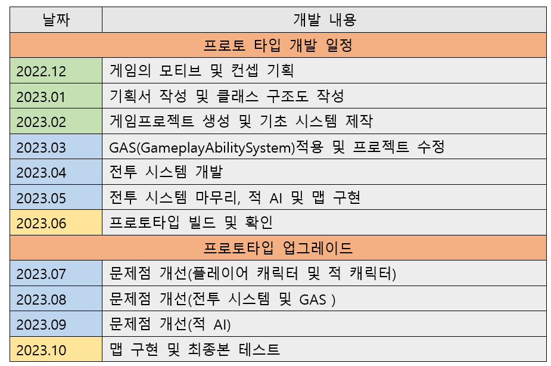

# MakeGame

# 졸업 작품 및 포트폴리오 정리

## 목차
+ ### [1.게임의 장르 및 컨셉 플랫폼](#1-게임의-장르-및-컨셉-플랫폼)
+ ### [2.모티브](#2-모티브가-된-게임)
+ ### [3.용어 설명](#3-용어-설명)
+ ### [4.개발 툴 및 언어](#4-개발-툴-및-언어)
+ ### [5.게임 흐름 및 클래스 구조](#5-게임-흐름-및-클래스-구조)
+ ### [6.게임 시스템 정리](#6-게임-시스템-정리)
+ ### [7.개발 일정](#7-개발-일정)
+ ### [8.개발 요약](#8-개발-요약)
+ ### [9.버그 및 개선 사항](#9-버그-및-개선-사항)

## 1 게임의 장르 및 컨셉 플랫폼
+ ### 장르: 액션RPG
+ ### 컨셉1. 몬스터와의 전투를 통해 플레이어가 성취감을 느낄 수 있다.
+ ### 컨셉2. 여러 스킬과 무기를 사용하고 공격과 페링을 적절히 사용하는 전투
+ ### 컨셉3. 강한 타격감과, 이펙트로 플레이어의 몰입감을 높이는 전투 시스템
+ ### 플랫폼: PC

## 2 모티브가 된 게임
### 모티브가 된 게임: God Of War(2018) & SEKIRO: SHADOWS DIE TWICE
### -God Of War(2018)-
+ #### 해당 게임을 플레이 하면 강한 타격감과, 여러 무기 및 스킬을 사용하는 전투 방식으로 인하여 전투의 몰입도가 높고, 흥미를 유발하기 충분 함.
+ #### 이점을 모티브로 제작할 게임에서도 높은 전투 만족도(타격감, 이펙트)와 복수의 무기 및 스킬을 사용하는 전투를 구현할 것이다.

### -SEKIRO-
+ #### 세키로의 전투 시스템은 특이하게, 적의 체력(HP)을 감소시키는 것뿐만 아니라, 체간이라는 독특한 시스템을 이용하여, 적의 공격을 페링(튕겨내기)하거나, 공격하면 적에게 체간 수치를 쌓을 수 있고 체간이 가득 차면, 적에게 마무리 공격을 하는 형식의 전투 시스템을 가지고 있다.
+ #### 이점을 모티브로 제작할 게임에서도, 플레이어의 공격 및 페링을 적극적으로 사용하는 전투 시스템을 구현할 것이다.

## 3 용어 설명

|용어|설명|
|:------:|:-------------|
| 공격 |일반적인 공격을 말하며, 적은 량의 체력을 감소하고, 플레이어의 속성수치을 올려 준다.|
| 스킬 |쿨타임이 있는 특수한 공격으로 각각의 스킬마다 다른 효과를 가지고 있음+, 몇몇 스킬은 높은 데미지를 주고, 몇몇 스킬은 데미지는 낮지만 플레이어의 속성 수치를 올려준다.|
| 속성 수치 |특수 스킬을 사용하기위한 cost로 공격 및 몇몇 스킬을 통해 올리며, 가득 차면 특수 스킬을 사용 할 수 있게 된다.|
| 속성 과부하 |적 및 플레이어에게 적용되는 시스템으로, 일정량 이상 올라가면,  디버프를 부여 하며, 공격 및 스킬에 피격 시 채워진다.|
| 특수 스킬 |각 무기에 내장 되어있어 해당무기의 속성을 가지고 있는 특수한 스킬로 가장 높은 데미지를 가지고 있다.|
| 막기 |일반적인 공격을 막아주는 형태로 막을 때마다 소량의 과부화 게이지를 얻는다.|
| 튕겨내기(페링) |적의 특수한 스킬을 제외한 공격에 정확한 타이밍에 막기를 성공하면, 적의 공격을 튕겨내고, 적의 과부하 수치와 플레이어의 속성수치를 올린다.|

## 4 개발 툴 및 언어
+ ### 개발 툴: 언리얼엔진5.1.1, GameplayAbilitySystem(언리얼엔진 자체 플러그인), 
+ ### 언어: C++ 및 블루프린트
+ ### 플러그인: Enhanced Input(향상된 입력), GameplayAbilitySystem

### 4-1 플러그인 설명
+ #### Enhanced Input(향상된 입력): 복잡한 입력 처리, 런타임 컨트롤 리매핑 등 더욱 향상된 입력 기능, 방사상 데드존(dead zone), 조합 액션(chorded action), 컨텍스트에 따른 입력, 우선순위 지정 등의 기능과 에셋 기반 환경에서 원시 입력 데이터의 필터링 및 처리를 확장할 수 있는 능력을 제공함
+ #### GameplayAbilitySystem: 게임플레이 어빌리티 시스템(Gameplay Ability System) 은 RPG나 MOBA 타이틀에서 볼 수 있는 어빌리티 및 어트리뷰트 유형을 구축하기 위한 고도로 유연한 프레임워크, 제작하는 게임에선 스킬과 기본적인 HP 같은 스텟을 정의하고, GameplayTag를 통해 제어하여, 사용할 것
  
## 5 게임 흐름 및 클래스 구조

+ ### 5-1 게임 흐름도

+ ### 5-2 전투 흐름도

+ ### 5-3 클래스 구조

## 6 게임 시스템 정리

### GameplayTag 표

### 무기 시스템
#### 1.	설정: 마법의로 원소의 힘을 모아 무기로 구현함.
#### 2.	작동 요약
+ #### A.	장착: 무기 소환 후 캐릭터의 손에 부착함.
+ #### B.	해제: 캐릭터 손에 부착된 무기가 소환 해제됨
+ #### C.	작동 방식: 게임 시작과 동시에, 무기를 미리 보이지 않는 곳에 Spawn함, 장착하면, 해당 무기의 위치를 캐릭터의 손 위치로 이동시키고, 해제하면 원래 위치로 이동시킴,
+ #### D.	효과: 무기가 소환 및 해제 될 때 무기의 속성에 맞는 이펙트가 보이도록 함.

### 무기 속성 표

### 적 캐릭터 AI 시스템
### 1.	적 캐릭터 상태
+ #### 일반 상태 -> 정해진 구간을 순찰함.
+ #### 전투 상태 -> 플레이어를 인식 후 추적 및 패턴을 실행
+ #### 사망 -> 체력이 0이되어 사망

### 적 캐릭터 패턴
+ #### 추적 -> 플레이어를 인식 후 공격 범위에 들어올 때까지 앞으로 이동
+ #### 공격 ->공격 범위 안에 들어오면 공격 패턴 실행
+ #### 방어 -> 플레이어 에게 일정 횟수 이상 공격받거나, 플레이어와 거리가 벌어지면 방어 상태 실행
+ #### 페이즈 변환(보스 전용) -> 체력이 일정 수치 미만이 되면 페이즈 변환 -> 패턴이 변하거나 외형 변환

## 7 개발 일정

## 8 개발 요약

## ------------------------프로토 타입 개발 요약------------------------
### 12/26 ~ 12/30 
+ ### 12/26 프로젝트 기획서 작성 및 Github 작성
+ ### 12/27 ~ 12/30 클래스 구조도 작성
 
### 01/02 ~ 01/08
+ ### 01/02 클래스 기능 및 요소 작성
+ ### [01/03 ~ 01/04 메인캐릭터 이동 및 시점 구현](https://github.com/kimeorua/portfolio/blob/main/prototype/%EC%BA%90%EB%A6%AD%ED%84%B0%20%EC%9D%B4%EB%8F%99%20%EB%B0%8F%20%EC%8B%9C%EC%A0%90%20%EA%B5%AC%ED%98%84.md)
+ ### [01/06 ~ 01/08 애니메이션 오류 발생 및 수정](#애니메이션-에셋-오류-발생)

### 01/09 ~ 01/17
+ ### [01/09 캐릭터 후방 이동속도 감소](https://github.com/kimeorua/portfolio/blob/main/prototype/%EC%BA%90%EB%A6%AD%ED%84%B0%20%ED%9B%84%EB%B0%A9%20%EC%9D%B4%EB%8F%99%EC%86%8D%EB%8F%84%20%EA%B0%90%EC%86%8C.md) 
+ ### [01/10 캐릭터 달리기 구현](https://github.com/kimeorua/portfolio/blob/main/prototype/%EB%8C%80%EC%89%AC.md)
+ ### [01/11 ~ 01/12 캐릭터 회피 구현](https://github.com/kimeorua/portfolio/blob/main/prototype/%EC%BA%90%EB%A6%AD%ED%84%B0%20%ED%9A%8C%ED%94%BC%20%EA%B5%AC%ED%98%84.md)
+ ### [01/13 ~ 01/15 회피 시스템 개선, 클래스 개선](#회피-시스템-및-클래스-개선)
+ ### [01/16 캐릭터에 방패 부착](https://github.com/kimeorua/portfolio/blob/main/prototype/%EB%B0%A9%ED%8C%A8%20%EB%B6%80%EC%B0%A9.md)
+ ### [01/17 방어 애니메이션 구현](https://github.com/kimeorua/portfolio/blob/main/prototype/%EB%B0%A9%EC%96%B4%EC%95%A0%EB%8B%88%EB%A9%94%EC%9D%B4%EC%85%98.md)

### 01/25 ~ 01/27
+ ### [01/25 무기 장착 구현](https://github.com/kimeorua/portfolio/blob/main/prototype/%EB%AC%B4%EA%B8%B0%20%EC%9E%A5%EC%B0%A9%20%EA%B5%AC%ED%98%84.md)
+ ### [01/26 검 장착후 Locomotion Animation 변동 구현](https://github.com/kimeorua/portfolio/blob/main/prototype/%EA%B2%80%20%EC%9E%A5%EC%B0%A9%20%EC%95%A0%EB%8B%88%EB%A9%94%EC%9D%B4%EC%85%98.md)
+ ### [01/27 깃허브 정리 및 코드 정리]

### 01/30 ~ 02/03
+ ### [01/30 검 장착 로직 및 애니메이션 개선](#검-장착-로직-및-애니메이션-개선)
+ ### [02/01 검 공격 애니메이션 구현](https://github.com/kimeorua/portfolio/blob/main/prototype/%EA%B2%80%20%EA%B3%B5%EA%B2%A9.md)
+ ### [02/02 ~ 02/03 검 공격 오류 발생 및 개선](#검-공격-오류-발생-및-개선)

### [02/06 ~ 02/08 무기와의 연동 구현, 스킬 사용 구현](https://github.com/kimeorua/portfolio/blob/main/prototype/%EB%AC%B4%EA%B8%B0%EC%97%B0%EB%8F%99%20%EC%8A%A4%ED%82%AC.md)

### 02/14 ~ 02/17
+ ### [02/14 RPGHitComponent(충돌 시스템) 제작](https://github.com/kimeorua/portfolio/blob/main/prototype/RPGHitComponent.md)
+ ### [02/16 ~ 02/17 스킬에 충돌 시스템 적용 및 공격 이펙트,사운드 및 피격 이펙트 적용](https://github.com/kimeorua/portfolio/blob/main/prototype/%EC%8A%A4%ED%82%AC%EC%B6%A9%EB%8F%8C.md)

### 03/01 ~ 03/05 개강 준비로 인한 휴식

### 03/06 ~ 03/10
+ ### 03/06 프로젝트 정리
+ ### [03/07 ~ 03/09 GameplayAbilitySystem 구현](https://github.com/kimeorua/portfolio/blob/main/prototype/GameplayAbilitySystem%EA%B5%AC%ED%98%84.md)
+ ### [03/10 이동, 달리기, 회피 재구현](https://github.com/kimeorua/portfolio/blob/main/prototype/%EC%9D%B4%EB%8F%99%2C%20%EB%8B%AC%EB%A6%AC%EA%B8%B0%2C%20%ED%9A%8C%ED%94%BC%20%EC%9E%AC%EA%B5%AC%ED%98%84.md)

### 03/13 ~ 03/17
+ ### [03/13 방어 재구현](https://github.com/kimeorua/portfolio/blob/main/prototype/%EB%B0%A9%EC%96%B4%20%EC%9E%AC%EA%B5%AC%ED%98%84.md)
+ ### [03/14 무기 장착 재구현 및 방어 개선](https://github.com/kimeorua/portfolio/blob/main/prototype/%EB%AC%B4%EA%B8%B0%20%EC%9E%A5%EC%B0%A9%20%EC%9E%AC%EA%B5%AC%ED%98%84%20%EB%B0%8F%20%EB%B0%A9%EC%96%B4%20%EA%B0%9C%EC%84%A0.md)
+ ### 03/15 c++, 블루프린트 및 깃허브 정리
+ ### [03/16 콤보 공격 구현](https://github.com/kimeorua/portfolio/blob/main/prototype/%EC%BD%A4%EB%B3%B4%20%EA%B3%B5%EA%B2%A9%20%EA%B5%AC%ED%98%84.md)
+ ### [03/17 스킬 구현](https://github.com/kimeorua/portfolio/blob/main/prototype/%EC%8A%A4%ED%82%AC%20%EA%B5%AC%ED%98%84.md)

### 03/20 ~ 03/24
+ ### [03/20 ElementalForce및 MaxElementalForce 설정, 특수 스킬기초 구현](https://github.com/kimeorua/portfolio/blob/main/prototype/EP%20%EB%B0%8F%20MaxEP%20%EC%84%A4%EC%A0%95%2C%20EPSkill.md)
+ ### [03/21 ~ 03/22 ElementalForce 스킬 제작 및 스킬사용 구현, Ability 사용을위한 조건문 코드 개선 및 방패 효과 추가](https://github.com/kimeorua/portfolio/blob/main/prototype/EP%EC%8A%A4%ED%82%AC%20%EC%A0%9C%EC%9E%91%20%EB%B0%8F%20%EC%8A%A4%ED%82%AC%EC%82%AC%EC%9A%A9%20%EA%B5%AC%ED%98%84.md)
+ ### [03/23 ~ 03/25 두번째 무기(도끼) 구현](https://github.com/kimeorua/portfolio/blob/main/prototype/%EB%8F%84%EB%81%BC.md)

### 03/28 ~ 03/31
+ ### [03/28 기본EnemyClass 제작 및 이동 애니메이션, 기초 스텟 설정](https://github.com/kimeorua/portfolio/blob/main/prototype/EnemyClass%20%EC%A0%9C%EC%9E%91.md)
+ ### [03/29 Enemy RandomPatrol 구현](https://github.com/kimeorua/portfolio/blob/main/prototype/Enemy%20RandomPatrol.md)
+ ### [03/30 플레이어 추적 구현](https://github.com/kimeorua/portfolio/blob/main/prototype/%ED%94%8C%EB%A0%88%EC%9D%B4%EC%96%B4%20%EC%B6%94%EC%A0%81%20%EA%B5%AC%ED%98%84.md)

### 04/03 ~ 04/07
+ ### [04/03 충돌처리 방식 고안](https://github.com/kimeorua/portfolio/blob/main/prototype/%EC%B6%A9%EB%8F%8C%20%EC%B2%98%EB%A6%AC%20%EB%B0%A9%EC%8B%9D%20%EA%B3%A0%EC%95%88.md)
+ ### [04/04 스킬 충돌 및 데미지 판정](https://github.com/kimeorua/portfolio/blob/main/prototype/%EC%8A%A4%ED%82%AC%20%EC%B6%A9%EB%8F%8C%20%EB%B0%8F%20%EB%8D%B0%EB%AF%B8%EC%A7%80%20%ED%8C%90%EC%A0%95.md)
+ ### [04/05 일반공격 Ability 재 구현 및 데미지 판정](https://github.com/kimeorua/portfolio/blob/main/prototype/%EC%9D%BC%EB%B0%98%EA%B3%B5%EA%B2%A9%20Ability%20%EC%9E%AC%20%EA%B5%AC%ED%98%84.md)
+ ### [04/06 Enemy 피격모션 구현](https://github.com/kimeorua/portfolio/blob/main/prototype/Enemy%20%ED%94%BC%EA%B2%A9%EB%AA%A8%EC%85%98%20%EA%B5%AC%ED%98%84.md)
+ ### [04/07 콤보 공격 개선](#콤보-공격-개선)

### 04/10 ~ 04/14
+ ### [04/10 AI 공격 범위 설정 및 전투 <-> 추적 변환 구현](https://github.com/kimeorua/portfolio/blob/main/prototype/%EA%B3%B5%EA%B2%A9%20%EB%B2%94%EC%9C%84%20%EC%84%A4%EC%A0%95.md)
+ ### [04/11 AI 공격 기초 로직 구현](https://github.com/kimeorua/portfolio/blob/main/prototype/%EA%B3%B5%EA%B2%A9%20AI%20%EA%B8%B0%EC%B4%88%20%EB%A1%9C%EC%A7%81%20%EA%B5%AC%ED%98%84.md)
+ ### [04/12 AI 콤보공격 패턴 완성](https://github.com/kimeorua/portfolio/blob/main/prototype/%EA%B3%B5%EA%B2%A9%20AI%20%EA%B8%B0%EC%B4%88%20%EB%A1%9C%EC%A7%81%20%EA%B5%AC%ED%98%84.md)
+ ### [04/13 AI 2번째 근접 공격 패턴 추가](https://github.com/kimeorua/portfolio/blob/main/prototype/2%EB%B2%88%EC%A7%B8%20%EA%B7%BC%EC%A0%91%20%EA%B3%B5%EA%B2%A9%20%ED%8C%A8%ED%84%B4.md)
+ ### 04/14 AI 3번째 근접 공격 패턴 추가

### 04/17 ~ 04/19
+ ### 04/17 적 캐릭터 공격 판정 추가 (플레이어 공격 판정과 동일)
+ ### 04/18 플레이어 캐릭터 데미지 판정 추가 (적 데미지 판정과 동일)
+ ### [04/19 플레이어 방어 판정 구현](https://github.com/kimeorua/portfolio/blob/main/prototype/%ED%94%8C%EB%A0%88%EC%9D%B4%EC%96%B4%20%EB%B0%A9%EC%96%B4%20%ED%8C%90%EC%A0%95.md)

### 04/20 ~04/28
+ ### [04/20 ~ 04/26 전투 시스템 버그 발생 및 수정](#전투-시스템-버그-발생-및-수정)
+ ### [04/27 패링 기능 구현](https://github.com/kimeorua/portfolio/blob/main/prototype/%ED%94%8C%EB%A0%88%EC%9D%B4%EC%96%B4%20%ED%8C%A8%EB%A7%81%20%EA%B5%AC%ED%98%84.md)

### 05/01 ~ 05/05
+ ### [05/01 범위형 공격 데미지 처리 구현, 페링 시 적 움찔 에니메이션 추가](https://github.com/kimeorua/portfolio/blob/main/prototype/%EB%B2%94%EC%9C%84%ED%98%95%EB%8D%B0%EB%AF%B8%EC%A7%80.md)
+ ### 05/02 플레이어, 적 기절 및 죽음 구현
+ ### 05/03 방어 및 페링 이펙트 추가 및, 스킬 공격 시 ElementalForce충전 구현
+ ### 05/04 보스 캐릭터 기초 제작(EnemyClass를 상속받아 구현 함.)
+ ### 05/05 보스 캐릭터 AI 추적 및 랜덤 패트롤 구현(일반 적 캐릭터와 동일한 방식 - 설명 생략)

### 05/08 ~ 05/12 보스 캐릭터 AI 제작 (일반 적 캐릭터와 동일)

### 05/15 ~ 05/19
+ ### 05/15 체력 회복 구현
+ ### 05/16 보스 피격 사운드 및 이펙트 출력, 과부화 수치 자동 감소 구현
+ ### 05/17 플레이어 HP, ElementalForce, Overload UI 구현

### 05/22 ~ 05/26
+ ### 05/22 보스 및 몬스터 사망 이펙트 개선
+ ### 05/23 스턴 상태 이펙트 및 사운드 추가
+ ### 05/24 게임 시작 및 종료, 일시정지 UI 구현

### 05/29 ~ 06/02 일반 스테이지 및 보스 스테이지 구현

### 06/05 프로토타입 빌드 및 가동 확인

## ------------------------게임 시스템 업그레이드 개발 요약------------------------

### 06/26 ~ 06/30 프로토타입에서 발견된 문제점 고찰 및 개선
+ ### [06/26 프로토타입에서 발견된 문제점 고찰](#프로토타입에서-발견된-문제점-고찰-및-개선)
+ ### 06/27 플레이어 행동 및 상태Tag 정의 및 정리(기초)
+ ### 06/28 프로젝트 재생성 및 기초 캐릭터 클래스(BaseCharacter)및 플레이어 캐릭터(PlayerCharacter)구현, GameplayAbilitySystem, 향상된 입력 적용
+ ### 06/29 - 06/30 기본 걷기, 달리기, 대기상태 애니메이션 리타겟팅 및 달리기 구현, 해당 행동, 상태에 따른 GameplayTag 부착 및 제거 구현

### 07/03 ~ 07/07
+ ### 07/03 플레이어 캐릭터 회피 작동 개선
+ ### 07/04 무기 시스템 재 구상 및 정리
+ ### 07/05 플레이어 무기 소환 및 장착 구현
+ ### 07/06 무기 장착시 애니메이션 변화 재 구현
+ ### 07/07 코드 최적화 및 깃허브 업로드
  
### 07/10 ~ 07/14
+ ### 07/10 콤보공격 개선
+ ### 07/11 ~ 07/12 일반 스킬 및 특수 스킬 작동 개선
+ ### 07/13 일반 스킬 및 특수스킬 이펙트 작업
+ ### 07/14 방어 작동 개선

### 07/17 ~ 07/21
+ ### 07/17 방어 작동 이펙트 추가
+ ### 07/18 Enemy Base Class 작성 및 AI Class 작성, 플레이어 인식 구현
+ ### 07/19 깃허브 정리 및 코드 업로드
+ ### 07/20 플레이어 인식 후 추적 구현
+ ### 07/21 적 캐릭터 AI 시스템 정리 및 Tag 정의

### 07/24 ~ 08/04
+ ### 07/24 골렘형 적 AI행동트리 구상
+ ### 07/25 Patrol Ability 및 AI 로직 구현
+ ### 07/31 인식 후 추적 및 공격 범위안에 들어오면 정지 AI 구현
+ ### 08/01 AI 콤보공격 구현
+ ### 08/02 AI 콤보 공격 개선
+ ### 08/03 적 캐릭터 사운드 추가 및 감쇠 효과 적용
+ ### 08/04 코드 업로드

### 08/07 ~ 08/11
+ ### 08/07 적 AI 플레이어 주시 개선
+ ### 08/08 일반공격 Overlap판정 구현
+ ### 08/09 일반공격 판정 변경 및 적중 시 적 캐릭터의 HP 감소 구현
+ ### 08/10 일반공격 판정 개선
+ ### 08/11 일반공격 적중시 적 피격 모션 출력 구현

### 08/14 ~ 08/18
+ ### 08/14 무기 중심 범위 스킬 및 플레이어 중심 범위 스킬 Collision 구현 및 적HP 감소 적용
+ ### 08/16 적 캐릭터의 공격 판정 구현 및 플레이어 HP 감소 구현
+ ### 08/17 플레이어 피격 모션 구현
+ ### 08/18 플레어 방어 구현 및 체간 구현, 코드 업로드

### 08/21 ~ 08/25
+ ### 08/21 방어 피격 모션 및 패링 판정 구현
+ ### 08/22 페링 모션 및 적 체간 상승 구현
+ ### 08/23 피격후 공격 불가 현상 수정
+ ### 08/24 피격 및 방어, 페링시 사운드 & 파티클 출력
+ ### 08/25 코드 업로드

### 08/28 ~ 09/01
+ ### 08/28 락온 기능 구현
+ ### 08/29 락온 중 이동 및 회피 변경 -> 좌우 이동 시, 정면을 바라보도록 변경, 회피 시 해당 방향키 방향으로 구르는 애니메이션 추가
+ ### 08/30 플레이어가 공격 성공 시 EF 충전구현, HP감소 및 체간 획득 시스템 변경
+ ### 08/31 필요없는 c++ 클래스 제거 및 적 캐릭터AI 재 구상
+ ### 09/01 AI Patrol 개선 및 코드 업로드

### 09/04 ~ 09/08
+ ### 09/14 AI 플레이어 추격 구현
---

## 9 버그 및 개선 사항

### 애니메이션 에셋 오류 발생
+ #### 문제점: 현제 사용할려는 애니메이션과 캐릭터 에셋간의 스켈레톤 구조가 매우 다름, 리타겟팅을 써도 사용 불가, 새로운 캐릭터 에셋 및 애니메이션을 사용 해야 함,
+ #### 해결 사용할려는 애니메이션에 제일 비슷한 구조를 가진 pragon에셋을 사용하도록 결정, 추가로 프로젝트 파일 정리 실시.
---

### 회피 시스템 및 클래스 개선
+ #### 문제점: 회피하면서 카메라 시점을 회전하면 캐릭터도 그에 맞게 회전됨 -> 후에 Idle 상태를 추가하여 이동 입력이 들어오면 Move로 바꾸고 이 경우에만 카메라 시점이 회전하면 캐릭터가 회전 하도록 수정 해볼 것
+ #### 1차 개선(01/13): Enum에 Idle 상태를 추가하여 Move(이동), Dodge(회피), Idle(대기)3가지의 상태를 만들어 각각 해당하는 입력에 따라 캐릭터의 bUseRotatuonYaw값을 수정 하도록 설계

### 2차 오류 발생(01/14)
+ #### 문제점: 회피는 BindAction이고 움직임은 BindAxis라 서로 작동 다름, 따라서 움직임키에 BindAction할 이벤트를 새로 작성하여 구현, Move -> Dodge -> Idel의 상태 변화에는 성공 하였음, 그러나 회피후 이동 키를 다시 한번 눌러야 하는 점이나, 사선 이동 -> 직선 이동으로 변경시 이동이 끊기는 상황이 생겨, 해당 안은 폐기함
+ #### 2차 개선(01/15): Enum에 따로 추가하지않고 기본상태를 Move로, 회피 시에만 Dodge상태로 바꾸며 이때 직접적으로, bUseRotatuonYaw값을 수정하여 회피시에 카메라 회전에 따라 캐릭터의 이동을 막음 -> 생각한 이동 방식 적합하다고 판단하여 해당 방식으로 구현함

#### 클래스 개선(01/15)
+ #### MainCharacter.h에 있던 ENum을 MainState에서 MoveState로 이름을 변경, BaseCharacter.h로 위치를 이동
+ #### -> 이유: 후에 몬스터도 해당 ENum을 사용하여 상태를 조절 할 예정, 따로 추가하는 것보단 같은 부모 클래스에 작성하는 것이 효율적이라고 판단.

---

### 검 장착 로직 및 애니메이션 개선
+ #### 검 장착시 바로 장착 되는 것이 아닌 등에 메고 있는 검을 '장비' 하는 애니메이션을 추가함, 또한 MoveState에 장착에 해당하는 MS_Equip을 추가하여 플레이어가 무기를 장비 하는 동안에는 움직임, 회피, 방어를 하지 못하게 만들어 플레이어가 무기를 변경 하는것 또한 전략적으로 생각 해야할 여건을 만듬

---

### 검 공격 오류 발생 및 개선
+ #### 문제점: 무기 장착 여부에 관계없이 공격 키만 누르면 공격이 작동됨, 또한 무기와 공격애니메이션 간의 연결점이 없어 따로 따로 설정 해야함, 
+ #### 무기 장착 여부를 확인 하기 위한 CurrentWeapon변수를 추가함,
+ #### 회피 도중 공격 키를 눌르면 회피를 멈추고 공격을 하는 문제점 확인 -> 회피 도중에 공격을 할수 없게 조건을 추가하여 개선
+ #### 같은 방식으로 방어 상태에서 애니메이션이 겹쳐는 문제 발생 하여 이 부분도 추작적인 조건문을 사용하여 개선 함

---

### 콤보 공격 개선
+ #### 콤보 공격을 Ability로 구현 하였으나, 공격기능이 어색하고, 의도치 않은 방식으로 작동 되는 것을 확인함
+ #### 해결 법: Youtube에서 "UE備忘録本舗" 라는 사람이 올린 동영상을 보고 해당 방식을 인용하여 사용 하기로 함
+ #### 사이트URL: https://www.youtube.com/watch?v=e7btrlL5Kas&t=1705

---

### 전투 시스템 버그 발생 및 수정
+ #### 피격시 일반 공격을 하면 회피와 움직이는것 말고는 모든 입력이 막힘 -> 해결(04/26)
+ #### 피격시 몬스터의 AI가 정지하는 현상 발견 -> (04/28)
+ #### 전투 시스템의 개선이 필요
+ #### 04/24 플레이어 일반 피격 개선: GA_Hit Ability를 사용하여, 몽타주가 재생 되는 동안 Player.Hit Tag를 플레이어 에게 붙임 -> 이 Tag가 있는 동안 공격Ability가 작동 하지 못하도록 구현함. (이 방식을 이용하여 적AI 및 방어 개선에도 사용 가능 할 것으로 )
+ #### 04/25 방어 기능을 개선 -> "Enhanced Input" 플러그인을 사용하여 방어 입력과, 홀드기능을 개선하였음
+ #### 04/26 방어 기능 완성 -> 방어 애니메이션을 추가 하여 방어 기능을 완성함

### 프로토타입에서 발견된 문제점 고찰 및 개선
#### 발견된 문제점
+ #### 전투의 판정이 의도하지 않은 방식으로 작동되는 경우가 있음 -> 전투 충돌 시스템의 개선
+ #### 캐릭터의 행동이 몇몇은 C++로 몇개는 AbilitySystem으로 구현 되어있어, 확장하기 까다롭고, 불필요한 공정이 추가로 들어감 -> 캐릭터의 행동을 전반적으로 수정, GAS를 사용하여 재 정의 및 개선
+ #### 적 캐릭터의 AI가 단조롭고, 의도하지 않은 행동을 함 -> AI의 재구현 및 패턴의 다양화 시도
+ #### 각 무기군의 특징이 느껴지지 않음 -> 무기 시스템의 개선이 필요 
+ #### 언리얼 엔진 5.0 -> 5.1로 버전 업과 동시에 입력 시스템의 변화가 있음 -> 코드 재작성 필요
+ #### 기존프로젝트에서 진행 하려했으나, 수정할 점이 많다고 판단, 기존의 코드는 저장 되어 있으므로, 새로운 프로젝트에서 다시 만들고 코드는 수정하여 적용 하기로 함

### AI 콤보 공격 개선(08/02)
+ #### 콤보 공격 후 바로 다음 공격으로 바로 작동됨
+ #### 마지막 콤보 공격후 1~1.5초 대기 상태로 이동하여, 잠깐의 틈을 만들어 전투의 템포를 조절 함.

### 적 AI 플레이어 주시 개선(08/07)
+ #### 적 AI가 플레이어를 인식 후 행동할 때 플레이어를 주시 하지 않는 오류 발생
+ #### SetFocus() 및 ClearFocus() 함수를 이용하여, 플레이어를 주시 하도록 개선

### 일반공격 판정 변경(08/09)
+ #### 일반공격을 OverlapMultibyChannel()함수를 통해 구현 하였으나, Hit판정을 받아올수 없는 문제가 있었음.
+ #### 해당 함수를 LineTraceSingel로 변경함 -> Hit판정을 받아와 GameplayEventData를 생성하여, Event를 발생, GameplayEffct를 통해 HP 감소를 구현함.

### 일반공격 판정 개선(08/10)
+ #### 기존의 일반공격 판정은 적1개체에만 적중 되었음.
+ #### 기존의 방식에서 일반공격이 작동되면 검이 지나가는 범위에 있는 모든 적에게 적중 할수 있도록 배열을 이용하여 개선함.

### 피격 시 공격 불가 현상 수정(08/11)
+ #### 플레이어가 피격 된후, 공격버튼을 눌러도 공격이 작동 하지 않는 문제 발생
+ #### 분석 결과 피격이 되었어도, 현제 작동중인 공격 Ability가 중지 되지 않고, Tag또한 부착 된상태로 유지되는 것을 확인
+ #### 피격후 Tag 제거 및 Ability 작동 중지를 추가함
  
### HP감소 및 체간 획득 시스템 변경
+ #### HP, 체간, EF Attribute값에 집적 수정하는 것이 아닌, Damage, ChargeEF, PostrueUP Attribute를 작성 후, 해당 Attribute에 값이 설정되면 변경되는 형식으로 변경함.
+ #### 후에 GameplayEffectCalculate를 통해 무기 또는 스킬마다 다른 데미지 및 체간 상승을 위하여 변경을 함.
+ #### 해당 방식은 공격 성공시 EF 충전에도 같은 방식을 적용

### 적 캐릭터 AI 재 구상
+ #### 게임을 플레이하면서 적 캐릭터의AI패턴이 기획한 전투와 다른 모습을 띄어 변경 하도록 함.
+ #### 문제점: 패턴과 패턴사이의 간극이 너무 짧음, 적 캐릭터가 피격 후 매우 빠른속도로 반격을 하기에 플레이어가 공격을 할 여유가 없음, AI구성이 복잡하여 후에 추가 및 변경이 곤란함.
+ #### AI 재 구성을 위한 예시자료 및 영상을 확인하여, 기초부터 다시 작성할 예정
