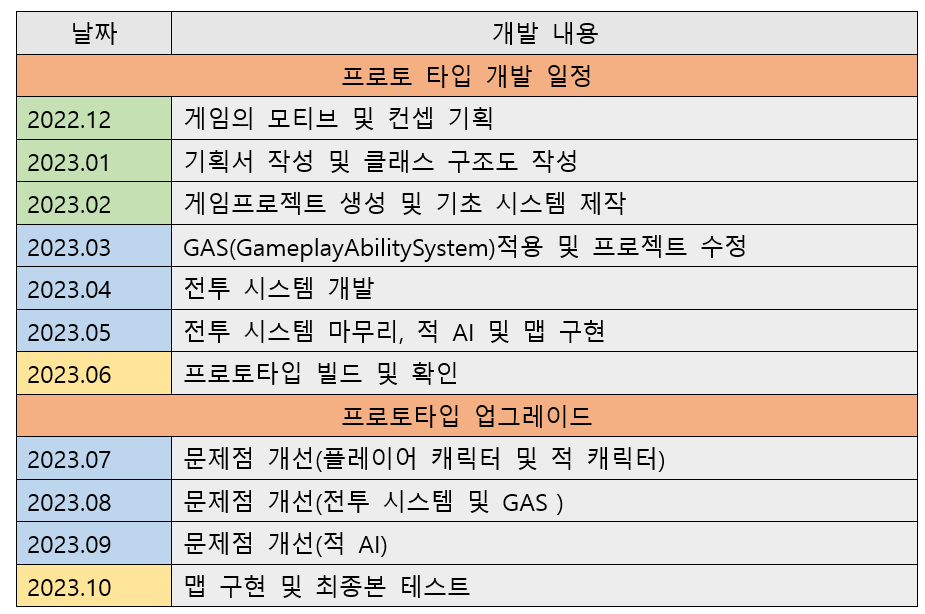

# MagicKnight

### [게임 파일] (https://drive.google.com/file/d/1KxsD7Ux-HgiN-rVLcRbLNsiMT3DKebCF/view?usp=sharing)
+ #### 실행법: 압축 해제 -> MagicKnight -> Windows -> PF_MagicKnight.exe 실행
### [시현 영상] (https://www.youtube.com/watch?v=-506RGWtlkM)
 
# 졸업 작품 및 포트폴리오 정리

## 목차
+ ### [1.게임 개요](#1-게임의-개요)
+ ### [2.모티브](#2-모티브가-된-게임)
+ ### [3.개발 툴 및 언어](#3-개발-툴-및-언어)
+ ### [4.개발 일정](#4-개발-일정)
+ ### [5.핵심 개발 기술 정리](5-핵심-개발-기술-정리)
+ ### [6.후기](5-후기)

## 1. 게임의 장르 및 컨셉 플랫폼
+ ### 장르: 액션RPG
+ ### 컨셉1. 몬스터와의 전투를 통해 플레이어가 성취감을 느낄 수 있다.
+ ### 컨셉2. 여러 스킬과 무기를 사용하고 공격과 페링을 적절히 사용하는 전투
+ ### 컨셉3. 강한 타격감과, 이펙트로 플레이어의 몰입감을 높이는 전투 시스템
+ ### 플랫폼: PC

### [맨위로](#)

## 2. 모티브가 된 게임
### 모티브가 된 게임: God Of War(2018) & SEKIRO: SHADOWS DIE TWICE
### -God Of War(2018)-
+ #### 해당 게임을 플레이 하면 강한 타격감과, 여러 무기 및 스킬을 사용하는 전투 방식으로 인하여 전투의 몰입도가 높고, 흥미를 유발하기 충분 함.
+ #### 이점을 모티브로 제작할 게임에서도 높은 전투 만족도(타격감, 이펙트)와 복수의 무기 및 스킬을 사용하는 전투를 구현할 것이다.

### -SEKIRO-
+ #### 세키로의 전투 시스템은 특이하게, 적의 체력(HP)을 감소시키는 것뿐만 아니라, 체간이라는 독특한 시스템을 이용하여, 적의 공격을 페링(튕겨내기)하거나, 공격하면 적에게 체간 수치를 쌓을 수 있고 체간이 가득 차면, 적에게 마무리 공격을 하는 형식의 전투 시스템을 가지고 있다.
+ #### 이점을 모티브로 제작할 게임에서도, 플레이어의 공격 및 페링을 적극적으로 사용하는 전투 시스템을 구현할 것이다.

### [맨위로](#)

## 3. 개발 툴 및 언어
+ ### 개발 툴: 언리얼엔진5.1.1, GameplayAbilitySystem(언리얼엔진 자체 플러그인), 
+ ### 언어: C++ 및 블루프린트
+ ### 플러그인: Enhanced Input(향상된 입력), GameplayAbilitySystem

### [맨위로](#)

## 4. 개발 일정

## 5. 후기
### 개인 프로젝트를 진행하면서 느낀 점으로는 언리얼 엔진의 기능에 대해 생각보다 모르던 부분이 많았다는 점과, 빌드 후의 테스트의 중요성을 알게 되었는데, 가장 기억에 남는 것은 포트폴리오로 만든 개인 프로젝트에는 Save &amp; Load 기능을 만들었는데 에디터 상에서 문제없이 저장된 캐릭터의 정보, 위치, 저장한 맵, 무기의 해금 여부, 여태까지 처치한 적 정보가 잘 불러왔으나, 정작 빌드 하고 나서는 캐릭터의 위치 및 처치한 적의 정보가 제대로 불러와지지 않아, 캐릭터가 이상한 곳에 스폰 되거나, 잡은 적의 정보가 적용되지 않아 이미 잡은 적을 다시 잡아야 하는 문제점이 발생함.

### 이점을 고치기 위해, Log 출력을 이용하여 확인 해본결과, 에디터 상에서는 Game Mode의 Begin Play가 호출된 후 Level의 Begin Play가 호출되어 문제없이 작동되었으나,  빌드 버전에선 반대로 작동되는 것을 확인하여, 많이 당황했던 기억이 있음.

### 이후 캐릭터의 이동 및 처치한 적의 적용 기능을 Game Mode에서 작동하도록 구현하여 해당 문제점을 수정.
### 이런 경험을 통해, 아직 모르는 점이 많았다는 것을 알게 되었으며, 앞으로 계속 찾아봐야 한다는 것을 깨닫게 되었고, 프로젝트를 빌드한 후, 꼭 면밀히 확인해서 출시하기 전에 혹시 모를 버그를 찾고 예방하는 QA 작업이 매우 중요하다는 것을 깨닫게 됨. 

### [맨위로](#)
