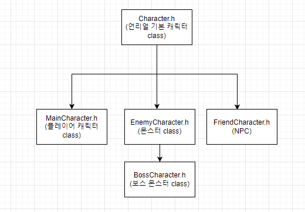
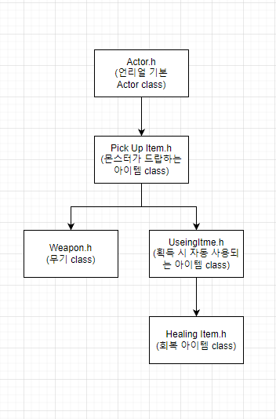

# MakeGame

# 졸업 작품 및 포트폴리오 정리

## 목차
+ ### [1.게임 설명](#게임-설명)
+ ### [2.클래스 구조](#클래스-구조)
+ ### [3.개발 요약](#개발-요약)
+ ### [4.발 사항](#개발-및-작성-사항)

## 게임 설명
+ ### 모티브: God Of War & Sekiro
+ ### God Of War: 공격 및 피격, 스킬사용 등에서 오는 짜릿한 타격감을 구현 할 예정
+ ### Sekiro: 패링위주의 전투를 구상해볼 예정
+ ### 장르: 액션RPG
+ ### 제작툴 및 언어: 언리얼엔진5 & C++
+ ### 한 줄 설명: 스테이지를 진행하면서 보스를 잡고 무기의 및 새로운 기술을 해금 하여 스태이지를 진행 그후 최종 보스를 잡는 형식의 게임

## 클래스 구조
+ ### 캐릭터 클래스

+ ### 아이템 클래스

## 개발 용약

### 12/26 ~ 12/30 

+ ### 12/26 클래스 구조도 작성 및 Github 작성
+ ### 12/27 메인 캐릭터 기능 및 변수 구상

## 개발 및 작성 사항

### 메인 캐릭터 (12/27)

#### --------------------------기능----------------------------
+ #### W(앞), A(좌), S(뒤), D(우)
+ #### 왼쪽Shift(대쉬)
+ #### 왼쪽마우스 클릭(공격 -> 연속으로 클릭하면 콤보 공격 가능)
+ #### 오른쪽마우스 클릭(방어 & 패링)
+ #### 숫자1, 2(무기 변경 키)
+ #### 왼쪽Ctrl(특수 사용)
+ #### 스페이스바(회피)
+ #### Q, E(일반 스킬)
+ #### R(회복 포션 사용)
+ #### I(정비창)
+ #### F(상호 작용)

#### --------------------------변수---------------------------
+ #### 현재 상태(이동, 방어, 공격, 스킬 사용, etc…..)
+ #### HP(생명력)
+ #### EP(속성력 -> 공격 or 패링시 상승, 꽉 차면 특수 스킬 사용)
+ #### 스킬 쿨 타임(Q, E 각 스킬마다 다른 쿨 타임 가짐)
