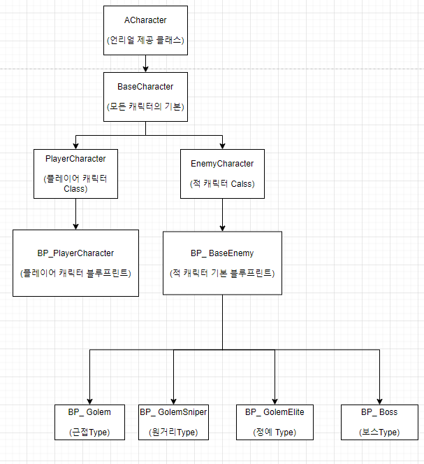

# MakeGame

# 졸업 작품 및 포트폴리오 정리

## 목차
+ ### 게임 설명
+ ### 클래스 구조
+ ### 주차별 개발 사항

## 게임 설명
+ ### 모티브: God Of War
+ ### God Of War: 공격 및 피격, 스킬사용 등에서 오는 짜릿한 타격감을 구현 하고 싶음
+ ### 장르: 액션RPG
+ ### 제작툴 및 언어: 언리얼엔진5 & C++
+ ### 한 줄 설명: 스테이지를 진행하면서 보스를 잡고 몇가지 무기의 해금 및 새로운 기술을 해금 하는 형식

## 클래스 구조
+ ### 캐릭터 클래스

+ ### 아이템 클래스

## 주자별 개발 사항

+ 주차별 개발 진행 사항 및 중요한 핵심 코드를 올려서 설명 or 이해한 내용을 적을 예정

## 12/26 ~ 12/30 개발 사항

+ ### 12/26 클래스 구조도 작성 및 Github 작성
