# MakeGame

# 졸업 작품 및 포트폴리오 정리

## 목차
+ ### [1.게임의 장르 및 컨셉 플랫폼](#1-게임의-장르-및-컨셉-플랫폼)
+ ### [2.모티브](#2-모티브가-된-게임)
+ ### [3.용어 설명](#3-용어-설명)
+ ### [4.게임 진행 방식](#4-게임-진행-방식)
+ ### [5.조작법](#5-조작법)
+ ### [6.개발 툴 및 언어](#6-개발-툴-및-언어)
+ ### [7.개발 일정](#7-개발-일정)
+ ### [8.게임 흐름 및 클래스 구조](#8-게임-흐름-및-클래스-구조)
+ ### [9.클래스 기능 및 요소 정리](#9-클래스-기능-및-요소-정리)
+ ### [10.개발 요약](#10-개발-요약)
+ ### [11.개발 사항](#11-개발-사항)
+ ### [12.버그 및 개선 사항](#12-버그-및-개선-사항)

## 1 게임의 장르 및 컨셉 플랫폼
+ ### 장르: 액션RPG
+ ### 컨셉1. 몬스터와의 전투를 통해 플레이어가 성취감을 느낄 수 있다.
+ ### 컨셉2. 여러 스킬과 무기를 사용하고 공격과 페링을 적절히 사용하는 전투
+ ### 컨셉3. 강한 타격감과, 이펙트로 플레이어의 몰입감을 높이는 전투 시스템
+ ### 플랫폼: PC

## 2 모티브가 된 게임
### 모티브가 된 게임: God Of War(2018) & SEKIRO: SHADOWS DIE TWICE
### -God Of War(2018)-
+ #### 해당 게임을 플레이 하면 강한 타격감과, 여러 무기 및 스킬을 사용하는 전투 방식으로 인하여 전투의 몰입도가 높고, 흥미를 유발하기 충분 함.
+ #### 이점을 모티브로 제작할 게임에서도 높은 전투 만족도(타격감, 이펙트)와 복수의 무기 및 스킬을 사용하는 전투를 구현할 것이다.

### -SEKIRO-
+ #### 세키로의 전투 시스템은 특이하게, 적의 체력(HP)을 감소시키는 것뿐만 아니라, 체간이라는 독특한 시스템을 이용하여, 적의 공격을 페링(튕겨내기)하거나, 공격하면 적에게 체간 수치를 쌓을 수 있고 체간이 가득 차면, 적에게 마무리 공격을 하는 형식의 전투 시스템을 가지고 있다.
+ #### 이점을 모티브로 제작할 게임에서도, 플레이어의 공격 및 페링을 적극적으로 사용하는 전투 시스템을 구현할 것이다.

## 3 용어 설명

|용어|설명|
|:------:|:-------------|
| 공격 |일반적인 공격을 말하며, 적은 량의 체력을 감소하고, 플레이어의 속성수치을 올려 준다.|
| 스킬 |쿨타임이 있는 특수한 공격으로 각각의 스킬마다 다른 효과를 가지고 있음+, 몇몇 스킬은 높은 데미지를 주고, 몇몇 스킬은 데미지는 낮지만 플레이어의 속성 수치를 올려준다.|
| 속성 수치 |특수 스킬을 사용하기위한 cost로 공격 및 몇몇 스킬을 통해 올리며, 가득 차면 특수 스킬을 사용 할 수 있게 된다.|
| 속성 과부하 |적 및 플레이어에게 적용되는 시스템으로, 일정량 이상 올라가면,  디버프를 부여 하며, 공격 및 스킬에 피격 시 채워진다.|
| 특수 스킬 |각 무기에 내장 되어있어 해당무기의 속성을 가지고 있는 특수한 스킬로 가장 높은 데미지를 가지고 있다.|
| 막기 |일반적인 공격을 막아주는 형태로 막을 때마다 소량의 과부화 게이지를 얻는다.|
| 페링 |적의 특수한 스킬을 제외한 공격에 정확한 타이밍에 막기를 성공하면, 적의 공격을 튕겨내고, 적의 과부하 수치와 플레이어의 속성수치를 올린다.|

## 4 게임 진행 방식
+ #### 스테이지 진행 방식: 해당 게임은 일반 몬스터를 잡는 일반 스테이지, 모든 몬스터를 잡으면 열리는 보스 스테이지 총 2개의 스테이지를 기본으로 구현할 예정이다.
+ #### 클리어 방식: 플레이어는 현제 가지고 있는 무기와 스킬을 이용하여, 일반 몬스터 및 보스를 쓰러트리고, 목표 지점에 도달하면 클리어되는 형식이다.
+ #### 전투: 플레이어는 공격과 스킬을 이용하여 적의 체력을 감소시키고, 회피를 이용하여   막을 수 없는 공격은 피하고, 페링을 적절히 사용하여 적의 공격을 막으면서 과부하 수치를 쌓아 적에게 디버프를 주고, 특수 스킬을 이용하여, 강력한 데미지를 주는 방식으로 진행된다. 

## 5 조작법
+ #### 이동: W, A, S, D
+ #### 공격: 마우스 좌 클릭
+ #### 막기: 마우스 우 클릭(홀딩)
+ #### 회피: 이동 키 + 스페이스 바
+ #### 달리기: 왼쪽 Shift
+ #### 특수 스킬: 왼쪽 Ctrl
+ #### 스킬: E, R
+ #### 상호 작용: F

## 6 개발 툴 및 언어
+ ### 개발 툴: 언리얼엔진5.0, GameplayAbilitySystem(언리얼엔진 자체 플러그인), 
+ ### 언어: C++ 및 블루프린트

## 7 개발 일정 
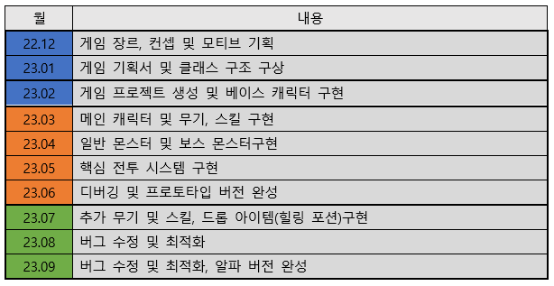

## 8 게임 흐름 및 클래스 구조

+ ### 8-1 게임 흐름도

+ ### 8-2 전투 흐름도

+ ### 8-3 클래스 구조


## 9 클래스 기능 및 요소 정리

### 1.메인 캐릭터 (12/27)
#### --------------------------요소---------------------------
+ #### 현재 상태(이동, 방어, 공격, 스킬 사용, etc…..)
+ #### HP(생명력)
+ #### EP(속성력 -> 공격 or 패링시 상승, 꽉 차면 특수 스킬 사용)
+ #### 스킬 쿨 타임(Q, E 각 스킬마다 다른 쿨 타임 가짐)
+ #### ES(강화 재료)
#### --------------------------기능----------------------------
+ #### Move(이동)
+ #### Dash(달리기)
+ #### Attack(공격)
+ #### Block(방어 & 패링)
+ #### Equip(무기 장착)
+ #### E_Skill(특수 사용)
+ #### Dodge(회피)
+ #### Skill(일반 스킬)
+ #### UsePortion(회복 포션 사용)
+ #### OpenItimeTap(정비창)
+ #### Interaction(상호 작용)

### 2.일반 몬스터(12/28)
#### --------------------------요소---------------------------
+ #### 현재 상태(이동, 공격, 사망, etc…..)
+ #### HP(생명력)
+ #### StackEP(속성력 누적치-> 플레이어의 공격에 피격 시 or 플레이어가 패링 성공 시 상승)
+ #### SturnTime(기절 시간)
+ #### Type(몬스터의 종류, 속성이나 근or원거리 등등)
#### --------------------------기능----------------------------
+ #### AI(공격, 대기, 플레이어에게 이동, etc…….)
+ #### 아이템드롭(회복 포션 or 강화 재료)

### 3-1.보스 몬스터 : 일반몬스터(상속) (12/29)
#### --------------------------요소---------------------------
+ #### 현재 상태(이동, 공격, 사망, etc…..)
+ #### HP(생명력)
+ #### StackEP(속성력 누적치-> 플레이어의 공격에 피격 시 or 플레이어가 패링 성공 시 상승)
+ #### SturnTime(기절 시간)
+ #### Type(몬스터의 종류, 속성이나 근or원거리 등등)
+ #### EP(특수 패턴용 속성치, 플레이어에게 피격or 공격 시 증가)
+ #### Pase(보스 페이즈 남은 HP 따라 변경)
#### --------------------------기능----------------------------
+ #### AI(공격, 대기, 플레이어에게 이동, etc…….)
+ #### 아이템드롭(회복 포션 or 강화 재료)

### 4.Item
#### --------------------------요소---------------------------
+ #### 회복량 (사용시 자원이 회복되는 양)
#### --------------------------기능---------------------------
+ #### PickUp(특정 거리에 플레이어가 오면 상호작용 키가 보이며 해당키를 누르면 PickUp)

### 5.무기
#### --------------------------요소---------------------------
+ #### Skill(무기에 장착된 스킬, 2개)
+ #### E_Skill(속성치가 다 차면 사용 가능한 스킬)
+ #### Damage(공격력)
#### --------------------------기능---------------------------
+ #### 콜리전On/Off(공격 시작 시 콜리전On 종료 시 Off)

---

## 10 개발 요약

### 12/26 ~ 12/30 
+ ### 12/26 프로젝트 기획서 작성 및 Github 작성
+ ### 12/27 ~ 12/30 클래스 구조도 작성
 
### 01/02 ~ 01/08
+ ### 01/02 클래스 기능 및 요소 작성
+ ### 01/03 ~ 01/04 메인캐릭터 이동 및 시점 구현
+ ### 01/06 ~ 01/08 애니메이션 오류 발생 및 수정

### 01/09 ~ 01/17
+ ### 01/09 캐릭터 후방 이동속도 감소 
+ ### 01/10 캐릭터 달리기 구현
+ ### 01/11 ~ 01/12 캐릭터 회피 구현
+ ### 01/13 캐릭터 시점 회피 오류 발생
+ ### 01/14 회피 1차 개선
+ ### 01/15 회피 2차 개선
+ ### 01/16 캐릭터에 방패 부착
+ ### 01/17 방어 애니메이션 구현

### 01/18 ~ 01/24 설 연휴로 인한 본가 방문

### 01/25 ~ 01/27
+ ### 01/25 무기 장착 구현
+ ### 01/26 검 장착시 작동될 애니메이션 구현
+ ### 01/27 깃허브 정리 및 코드 정리

### 01/30 ~ 02/03
+ ### 01/30 검 장착 로직 및 애니메이션 개선
+ ### 02/01 검 공격 애니메이션 구현
+ ### 02/02 검 공격 오류 발생
+ ### 02/03 검 공격 로직 개선

### 02/06 ~ 02/08
+ ### 02/06 무기와의 연동 구현
+ ### 02/08 스킬 사용 구현

### 02/14 ~ 02/17
+ ### 02/14 RPGHitComponent(충돌 시스템) 제작
+ ### 02/16 스킬에 충돌 시스템 적용
+ ### 02/17 공격 이펙트,사운드 및 피격 이펙트 적용

### 02/20 ~ 02/28 현장실습 마무리 주간 및 발표로 인한 휴식

### 03/01 ~ 03/05 개강 준비로 인한 휴식

### 03/06 ~ 03/10
+ ### 03/06 프로젝트 정리
+ ### 03/07 ~ 03/09 GameplayAbilitySystem 구현
+ ### 03/10 이동, 달리기, 회피 재구현

### 03/13 ~ 03/17
+ ### 03/13 방어 재구현
+ ### 03/14 무기 장착 재구현 및 방어 개선
+ ### 03/15 c++, 블루프린트 및 깃허브 정리
+ ### 03/16 콤보 공격 구현
+ ### 03/17 스킬 구현

### 03/20 ~ 03/24
+ ### 03/20 EP 및 MaxEP 설정, EPSkill(특수 스킬)기초 구현
+ ### 03/21 EP스킬 제작 및 스킬사용 구현
+ ### 03/22 Ability 사용을위한 조건문 코드 개선 및 방패 효과 추가
+ ### 03/23 두번째 무기(도끼) 구현 및 장착 구현
+ ### 03/24 두번째 무기 일반 스킬 애니메이션 구현

### 03/27 ~ 03/31
+ ### 03/27 두번째 무기 특수스킬 및 이펙트 추가
+ ### 03/28 기본EnemyClass 제작 및 이동 애니메이션, 기초 스텟 설정
+ ### 03/29 Enemy RandomPatrol 구현
+ ### 03/30 플레이어 추적 구현

### 04/03 ~ 04/07
+ ### 04/03 충돌처리 방식 고안
+ ### 04/04 스킬 충돌 및 데미지 판정
+ ### 04/05 일반공격 Ability 재 구현 및 데미지 판정
+ ### 04/06 Enemy 피격모션 구현
+ ### 04/07 콤보 공격 개선

### 04/10 ~ 04/14
+ ### 04/10 공격 범위 설정 및 전투 <-> 추적 변환 구현
+ ### 04/11 공격 AI 기초 로직 구현
+ ### 04/12 콤보공격 패턴 완성
+ ### 04/13 2번째 근접 공격 패턴 추가
+ ### 04/14 3번째 근접 공격 패턴 추가

### 04/17 ~ 04/19
+ ### 04/17 적 캐릭터 공격 판정 추가
+ ### 04/18 플레이어 캐릭터 데미지 판정 추가
+ ### 04/19 플레이어 방어 구현

### 04/20 ~ 04/26 중간고사 기간 -> 중간고사 준비를 하면서 시간이 날때마다 조금씩 구현
+ #### 04/20 피격 시 플레이어 및 몬스터가 정지하는 오류 발견
+ #### 04/24 일반 피격 개선
+ #### 04/25 방어 기능 개선

### 04/27 ~ 04/30
+ #### 04/27 패링 기능 구현
+ #### 04/28 적 피격 개선

### 05/01 ~ 05/05
+ #### 05/01 범위형 공격 데미지 처리 구현, 페링 시 적 움찔 에니메이션 추가
+ #### 05/02 플레이어, 적 기절 및 죽음 구현
+ #### 05/03 방어 및 페링 이펙트 추가 및, 스킬 공격 시 EP충전 구현
+ #### 05/04 보스 캐릭터 기초 제작

---
## 11 개발 사항

### 1.캐릭터 이동 및 시점 구현 (01/03 ~ 01/04)
+ #### 이동 방식: W, S, A, D키를 이용하여 앞, 뒤, 좌, 우 방향으로 이동 하도록 구현

```cpp

void AMainCharacter::SetupPlayerInputComponent(UInputComponent* PlayerInputComponent)
{
	Super::SetupPlayerInputComponent(PlayerInputComponent);

	PlayerInputComponent->BindAxis("Move Forward", this, &AMainCharacter::MoveForward); 	//앞, 뒤 이동
	PlayerInputComponent->BindAxis("Move Right", this, &AMainCharacter::MoveRight);		//좌, 우 이동
	PlayerInputComponent->BindAxis("Turn Right", this, &AMainCharacter::AddControllerYawInput); //시점 좌, 우
	PlayerInputComponent->BindAxis("Turn Up", this, &AMainCharacter::AddControllerPitchInput);  //시점 상, 하
}

void AMainCharacter::MoveForward(float Value)
{
	if ((Controller != nullptr) && (Value != 0.0f))
	{
		// 앞 진행 방향 찾기
		const FRotator Rotation = Controller->GetControlRotation();
		const FRotator YawRotation(0, Rotation.Yaw, 0);

		//Forward vector 계산
		const FVector Direction = FRotationMatrix(YawRotation).GetUnitAxis(EAxis::X);
		AddMovementInput(Direction, Value); // 해당 방향으로 이동
	}
}

void AMainCharacter::MoveRight(float Value)
{
	if ((Controller != nullptr) && (Value != 0.0f))
	{
		// 오른쪽 방향 찾기
		const FRotator Rotation = Controller->GetControlRotation();
		const FRotator YawRotation(0, Rotation.Yaw, 0);

		//Right vector 계산 
		const FVector Direction = FRotationMatrix(YawRotation).GetUnitAxis(EAxis::Y);
		AddMovementInput(Direction, Value);
	}
}
```

### 캐릭터 후방 이동속도 감소 구현 (01/09)

```cpp

void AMainCharacter::MoveForward(float Value)
{
	if ((Controller != nullptr) && (Value != 0.0f))
	{
		// 앞 진행 방향 찾기
		const FRotator Rotation = Controller->GetControlRotation();
		const FRotator YawRotation(0, Rotation.Yaw, 0);

		//Forward vector 계산
		const FVector Direction = FRotationMatrix(YawRotation).GetUnitAxis(EAxis::X);
		AddMovementInput(Direction, Value); // 해당 방향으로 이동

		//앞, 뒤에 따라 속도 변경
		if (Value > 0.f)
		{
			GetCharacterMovement()->MaxWalkSpeed = CurrentSpeed;
		}
		else if (Value < 0.f)
		{
			GetCharacterMovement()->MaxWalkSpeed = CurrentSpeed - BackwardSpeed;
		}
	}
}

```

#### 설명:후방 이동 시 BackwardSpeed 만큼 이동속도를 감소 시킴 -> 후방 이동시 이동 속도가 감소 됨

#### 대쉬: LShift 키를 누르고 있으면 대쉬를 하도록 구현(01/10)

```cpp
void AMainCharacter::Dash()
{
	if (!bUseDash)
	{
		bUseDash = true;
		CurrentSpeed = ForwardRunSpeed;
	}
}

void AMainCharacter::DashEnd()
{
	if (bUseDash)
	{
		bUseDash = false;
		CurrentSpeed = ForwardWalkSpeed;
	}
}
```

#### 설명: 키 입력을 받아 Shift키가 눌리면 이동속도를 ForwardRunSpeed(뛰기 속도)로 변경하고 눌리지 않았을 경우 ForwardWalkSpeed 걷기 속도로 변경 함

### 캐릭터 회피 구현(01/11 ~ 01/12)

+ ### MainCharacter.h

```cpp

// 캐릭터 상태 확인용 열거형
UENUM()
enum class MainState : uint8
{
	MS_Move UMETA(DisplayName = "Move"), // 움직임 생타
	MS_Dodge UMETA(DisplayName = "Dodge"), //회피 상태

	MS_Max
};

UCLASS()
class MYGAME_API AMainCharacter : public ABaseCharacter
{
private:
	UPROPERTY(VisibleAnywhere, BlueprintReadOnly, Category = Combet, meta = (AllowPrivateAccess = "true"))
	int32 MoveNum = 1; // W, S, A, D 키 입력에 따라 변하여 회피하는 방향을 결정함

	class UMainAnimInstance* MainAnimInstance; // 캐릭터의 애니메이션 변수

	UPROPERTY(VisibleAnywhere, BlueprintReadOnly, Category = Combet, meta = (AllowPrivateAccess = "true"))
	MainState State; //캐릭터 상태Enum
	
	void Dodge() //회피 실행 함수
public:
	void DodgeEnd(); // 회피 종료 함수, 애니메이션의 AnimNotify에 의해 자동으로 호출되어 실행 됨
}

```

+ ### MainCharacter.cpp

```cpp
void AMainCharacter::MoveForward(float Value)
{
	//중략//
	if (Value >= 0)
	{
		MoveNum = 1;
	}
	else if (Value < 0)
	{
		MoveNum = 2;
	}
}

void AMainCharacter::MoveRight(float Value)
{
	//중략//
	if (Value > 0)
	{
		MoveNum = 3;
	}
	else if (Value < 0)
	{
		MoveNum = 4;
	}
}
void AMainCharacter::Dodge()
{
	State = MainState::MS_Dodge; // 현재 상태를 Dodge로 변경 -> 이동은 Move 상태임으로 이동 불가 상태가 됨
	MainAnimInstance->PlayDodge(MoveNum); //MainAnimInstance.cpp에 회피 애니메이션 실행 함수 호출
}

void AMainCharacter::DodgeEnd()
{
	State = MainState::MS_Move; // 현재 상태를 Move로 변경
}
```

#### 설명: 현재 이동할려는 방향과 스페이스키를 누르면 해당 방향에 맞는 회피 모션이 나오도록 구현함 

### 캐릭터에 방패 부착(01/16)
+ #### 캐릭터의 왼쪽 팔에다가 ArmShield를 부착함, 장착한 무기에 상관없이 방패는 고정되는 형태로 후에 입력에 따른 방어 애니메이션을 추가할 예정

#### Shield.h

```cpp
class MYGAME_API AShield : public AActor
{
	GENERATED_BODY()
	
public:	
	// Sets default values for this actor's properties
	AShield();
private:
	UPROPERTY(VisibleAnywhere)
	USceneComponent* Root; //root컴포넌트

	UPROPERTY(VisibleAnywhere, BlueprintReadOnly, Category = Mesh, meta = (AllowPrivateAccess = "true"))
	UStaticMeshComponent* Mesh; //메시
};
```

#### Shield.cpp

```cpp
AShield::AShield()
{
 	// Set this actor to call Tick() every frame.  You can turn this off to improve performance if you don't need it.
	PrimaryActorTick.bCanEverTick = true;
	Root = CreateDefaultSubobject<USceneComponent>(TEXT("Root")); //root 컴포넌트 설정
	SetRootComponent(Root);

	Mesh = CreateDefaultSubobject<UStaticMeshComponent>("Messh"); //Mesh설정
	Mesh->SetupAttachment(Root);
}
```

#### MainCharacter.h

```cpp
UCLASS()
class MYGAME_API AMainCharacter : public ABaseCharacter
{
private:
	UPROPERTY(EditDefaultsOnly, BlueprintReadOnly, Category = Combet, meta = (AllowPrivateAccess = "true")) 
	TSubclassOf<AShield> ShieldClass;	// 블루프린트에서 설정할 방패

	UPROPERTY()
	AShield* Shield; //실제로 c++내에서 컨트롤 하는 방패
}
```
#### MainCharacter.cpp

```cpp
void AMainCharacter::BeginPlay()
{
	Shield = GetWorld()->SpawnActor<AShield>(ShieldClass); //방패 엑터를 월드상에 스폰
	Shield->AttachToComponent(GetMesh(), FAttachmentTransformRules::KeepRelativeTransform, TEXT("ShieldSocket")); // 스폰한 방패를 "ShieldSocket" 란 이름을 가진소켓 에 부착
	Shield->SetOwner(this);
}
```

### 방어 애니메이션 구현(01/17)


#### 설명: MainCharacter에 bUseBlock 변수를 통해, 마우스 우클릭을 누르면 방어 상태가 되어, 해당하는 애니메이션이 출력됨, 또한 방어 상태에서 이동이 가능 하도록, 본 레이어에 따라 블랜드 하여, Spine_01 본을 기준으로 애니메이션을 합쳐서 출력 되도록 구현, 이동중에도 방어가 가능 하게 구현 함.

```cpp

void AMainCharacter::BlockStart()
{
	if (State != MoveState::MS_Dodge && !bUseDash)
	{
		bUseBlock = true;
		State = MoveState::MS_Block;
	}
	else
	{
		return;
	}
}

void AMainCharacter::BlockEnd()
{
	if (State != MoveState::MS_Dodge && !bUseDash)
	{
		bUseBlock = false;
		State = MoveState::MS_Move;
	}
	else
	{
		return;
	}
}
```

#### 설명: MoveState에 MS_Block상태를 추가하여, 방어 상태인지 확인 할수 있게 하였고, 뛰는 도중에는 방어를 할수 없게 구현 하였다.

### 무기 장착 구현(01/25)

+ #### 구현 방식: 기본 상태에서는 무기를 등에 메고 있고, 키보드'1'번 키를 눌르면 무기를 손에 부착 하는 형태로 구현함, 추가적으로 현제 사용할려는 무기에 해당 하는 변수WeaponNum과, 실제 현재로 사용하는 무기 변수 UseWeaponNum을 이용해 후에 추가할 무기 교체 시스템에 사용할 예정

```cpp

void AMainCharacter::SelectSword()
{
	if (State == MoveState::MS_Move)
	{
		WeaponNum = 1; // 사용 할려는 무기 
		WeaponEquip(); // 무기 장착 함수
	}
	else { return; } // 회피 or 방어 중일때는 무기 장착 불가
}

void AMainCharacter::WeaponEquip()
{
	if (UseWeaponNum == WeaponNum) // 실제 사용하는 무기와 현제 키를 눌러 사용할려는 무기가 같을 경우 무기 교체 없음
	{ 
		return; 
	}
	else
	{
		if (WeaponNum == 1)
		{
			Sword->AttachToComponent(GetMesh(), FAttachmentTransformRules::KeepRelativeTransform, TEXT("WeaponHandSocket"));
			UseWeaponNum = 1;
		}
	}
}
```

### 검 장착 시 애니메이션 구현(01/26)

+ #### 검 장착 시 애니메이션의 변화를 주기로 함, 또한 걷기 애니메이션에도 변화를 주어 자연스럽게 검을 쥐고 걷는 애니메이션을 구현 함

+ #### 기본 상태


+ #### 검 장착 상태


### 검 장착 로직 및 애니메이션 개선(01/30)
+ #### 검 장착시 바로 장착 되는 것이 아닌 등에 메고 있는 검을 '장비' 하는 애니메이션을 추가함, 또한 MoveState에 장착에 해당하는 MS_Equip을 추가하여 플레이어가 무기를 장비 하는 동안에는 움직임, 회피, 방어를 하지 못하게 만들어 플레이어가 무기를 변경 하는것 또한 전략적으로 생각 해야할 여건을 만듬

### 검 공격 애니메이션 구현 (02/01)

+ #### 마우스 왼쪽 버튼을 클릭하면 공격 애니메이션을 출력 하도록 구현 하였으며, 총 4가지의 공격 애니메이션을 사용하여 콤보 공격을 구현 하엿다, 또한, 공격 중에는 이동 및 회피를 할수 없게 지정 하였다.

MainCharacter.cpp

```cpp
void AMainCharacter::LMBDawn() //마우스 클릭에 반응 하는 함수
{
	if (State != MoveState::MS_Attack) //공격 중이 아닐 때
	{
		Attack();
	}
	else if (State == MoveState::MS_Attack) //이미 공격 중일때 (콤보 공격 사용)
	{
		IsCombo = true;
	}
}

void AMainCharacter::Attack() //공격 함수, 메인캐릭터의 상태를 공격중으로 변경하고, 마우스 시점 방향으로 캐릭터를 회전, 해당 방향으로 공격을 실행하며, MainAnimInstace.cpp에서 콤보 애니메이션을 설정 함
{
	State = MoveState::MS_Attack;
	if (MainAnimInstance == nullptr) { return; }

	SetActorRotation(FRotator(0.f, GetControlRotation().Yaw, 0.f));
	MainAnimInstance->PlayAttack(CurrentCombo); // 현제 콤보 인수로 전달
}

void AMainCharacter::AttackEnd() //공격 종료 함수 -> 애님노티파이를 통해 호출됨
{
	State = MoveState::MS_Move;
	IsCombo = false;
	CurrentCombo = 1;
}

void AMainCharacter::CheackCombo() // 콤보 체크용 함수 -> 애님 노티파이를 통해 호출 
{
	if (CurrentCombo >= MaxCombo) 
	{
		CurrentCombo = 0; 
	}
	if (IsCombo == true) 
	{
		CurrentCombo += 1; 
		IsCombo = false; 
		Attack();
	}
}
```

MainAnimInstace.cpp

```cpp
void UMainAnimInstance::PlayAttack(int CurrentCombo) //현제 콤보에 따라 애니메이션 출력 함
{
	if (CurrentCombo == 1)
	{
		Montage_Play(AttackMontage);
		Montage_JumpToSection(FName("Attack1"), AttackMontage);
	}
	if (CurrentCombo == 2)
	{
		Montage_Play(AttackMontage);
		Montage_JumpToSection(FName("Attack2"), AttackMontage);
	}
	if (CurrentCombo == 3)
	{
		Montage_Play(AttackMontage, 1.2f);
		Montage_JumpToSection(FName("Attack3"), AttackMontage);
	}
	if (CurrentCombo == 4)
	{
		Montage_Play(AttackMontage, 1.2f);
		Montage_JumpToSection(FName("Attack4"), AttackMontage);
	}
	UE_LOG(LogTemp, Warning, TEXT("Combo"));
}
```

### 무기와의 연동 구현(02/06)
+ #### Weapon.h 에 해당 무기의 공격 애니메이션 몽타주와, 장착 애니메이션 몽타주를 변수로 추가하여, 언리얼 에디터 상에서 애니메이션을 설정하고 무기를 장착하면, 해당 에니메이션이 MainAnimInstace의 AttackMontage와 EquipMontage에 연동 되도록 추가 구현 함.

### 스킬 사용 구현(02/08)
+ #### Q, E 키를 누르면 해당하는 무기의 Q,E스킬 이 작동 되도록 구현, Weapon.h에 QSkillMontage 와 ESkillMontage를 변수로 넣고, 공격과 같은 방식으로 해당 무기와 연동되어 애니메이션을출력 하도록 구현함.

MainCharacter.cpp

```cpp
void AMainCharacter::QSkillActivated() //ESkill도 같은 방식으로 작동.
{
	if (CurrentWeapon != nullptr) // 현재 무기를 장착 하였는지 판단 장착했을경우에만 스킬 사용 가능
	{
		if (State == MoveState::MS_Move) // 현재 상태 확인, 공격이나 방어등 다른상태일땐 스킬 사용 불가
		{
			State = MoveState::MS_Skill; // 현재 상태 스킬 사용 중으로 변경
			MainAnimInstance->PlaySkill('Q'); // 애니메이션 호출
		}
	}
}
```

### RPGHitComponent(충돌 시스템)제작(02/14)
+ #### BoxComponent를 상속 받아 무기에 적용할 충돌 시스템인 RPGHitComponent 제작
+ #### 애니메이션에서 공격 시작 및 종료시 Collision을 On/Off 하도록 구현

#### RPGHitComponent.h

```cpp
private:
	URPGHitComponent(); //생성자

	UFUNCTION()
	void OnOverlapBegin(UPrimitiveComponent* OverlappedComponent, AActor* OtherActor, UPrimitiveComponent* OtherComp, int32 OtherBodyIndex, bool bFromSweep, const FHitResult& SweepResult); //overlap판정
```

#### RPGHitComponent.cpp

```cpp
URPGHitComponent::URPGHitComponent()
{
	PrimaryComponentTick.bCanEverTick = false; // Tick 함수 안 쓰니까 false로.

	OnComponentBeginOverlap.AddDynamic(this, &URPGHitComponent::OnOverlapBegin); //OnComponentBeginOverlap이벤트에 OnOverlapBegin함수를 바인드함.
}

void URPGHitComponent::OnOverlapBegin(UPrimitiveComponent* OverlappedComponent, AActor* OtherActor, UPrimitiveComponent* OtherComp, int32 OtherBodyIndex, bool bFromSweep, const FHitResult& SweepResult)
{
	if (OtherActor->IsA(AMainCharacter::StaticClass())) // Overlap한 Actor가 MainCharacter이면 무시
	{
		return;
	}
	else		// 그 외의 객체면 Overlap하면 log를 띄움
	{
		UE_LOG(LogTemp, Warning, TEXT("Hit!!"));
	}
	
}

void URPGHitComponent::BeginPlay()
{
	Super::BeginPlay();
	SetCollisionEnabled(ECollisionEnabled::NoCollision); // 게임 시작시 콜리전off
}
```

UMainAnimInstance.cpp

```cpp
void UMainAnimInstance::AnimNotify_AttackEnd() //공격 종료 -> Collision off
{
	Main->AttackEnd();
	URPGHitComponent* RPGHitComponent = Main->GetCurrentWeapon()->GetRPGHitComponent(); // 무기의 RPGHitComponent를 저장
	RPGHitComponent->SetCollisionEnabled(ECollisionEnabled::NoCollision); //Collision off
}

void UMainAnimInstance::AnimNotify_CheackCombo() // 콤보 공격 체크 -> 다음 콤보 공격을 하기전 Collision off 를하여, 추가적인 Overlap 방지
{
	Main->CheackCombo();
	URPGHitComponent* RPGHitComponent = Main->GetCurrentWeapon()->GetRPGHitComponent(); // 무기의 RPGHitComponent를 저장
	RPGHitComponent->SetCollisionEnabled(ECollisionEnabled::NoCollision); //Collision off
}

void UMainAnimInstance::AnimNotify_CollisionStart() // 공격 시작 -> Collision On
{
	URPGHitComponent* RPGHitComponent = Main->GetCurrentWeapon()->GetRPGHitComponent(); // 무기의 RPGHitComponent를 저장
	RPGHitComponent->SetCollisionEnabled(ECollisionEnabled::QueryOnly); Collision On
}
```

### 스킬에 충돌 시스템 적용(02/16)
+ #### 스킬 에니메이션에 CollisionStart와 AttackEnd 노티파이를 생성하여, 해당 시점에 Collision을 on/off 하도록 구현 함.

### 스킬 이펙트 및 피격 이펙트 적용(02/17)

+ #### 스킬 이펙트: 스킬 애니메이션에 노티파이로 SwordTrail나이아가라 시스템을 스폰하도록 설정, 일반공격 및 스킬 사용시 해당 모션에 맞는 이펙트와 사운드가 출력됨
+ #### 피격 이펙트: RPGComponent에 HitParticle을 변수로 추가하여, 블루프린트에서 설정, overlap시 파티클을 스폰 하는 형식으로 구현 함

```cpp
void URPGHitComponent::OnOverlapBegin(UPrimitiveComponent* OverlappedComponent, AActor* OtherActor, UPrimitiveComponent* OtherComp, int32 OtherBodyIndex, bool bFromSweep, const FHitResult& SweepResult)
{
	if (OtherActor->IsA(AMainCharacter::StaticClass()))
	{
		return;
	}
	else
	{
		UGameplayStatics::SpawnEmitterAtLocation(GetWorld(), HitParticle, GetComponentLocation());
	}
	
}
```

### GameplayAbilitySystem 구현 (03/07)
+ 프로젝트에 GameplayAbilitySystem플러그 인을 사용하여, 기초적인 Attribute, Ability, GameplayAbilityComponent를 구현하였음 그후 BaseCharacter class에 상속함
+ #### 참고 한 영상 https://www.youtube.com/watch?v=Yub52f4ZUU0&t=1580s
+ #### 참고 한 예시 프로젝트: UE4.27ver 액션RPG

CharacterAttributeSetBase
```cpp

// Uses macros from AttributeSet.h
#define ATTRIBUTE_ACCESSORS(ClassName, PropertyName) \
	GAMEPLAYATTRIBUTE_PROPERTY_GETTER(ClassName, PropertyName) \
	GAMEPLAYATTRIBUTE_VALUE_GETTER(PropertyName) \
	GAMEPLAYATTRIBUTE_VALUE_SETTER(PropertyName) \
	GAMEPLAYATTRIBUTE_VALUE_INITTER(PropertyName)

UCLASS()
class MYGAME_API UCharacterAttributeSetBase : public UAttributeSet
{
	GENERATED_BODY()
	
public:
	//현제 HP
	UPROPERTY(BlueprintReadOnly, Category = "Abilities", ReplicatedUsing = OnRep_Health)
	FGameplayAttributeData Health;
	ATTRIBUTE_ACCESSORS(UCharacterAttributeSetBase, Health)

	//최대 HP
	UPROPERTY(BlueprintReadOnly, Category = "Abilities", ReplicatedUsing = OnRep_MaxHealth)
	FGameplayAttributeData MaxHealth;
	ATTRIBUTE_ACCESSORS(UCharacterAttributeSetBase, MaxHealth)


	//-------------------------------------------Funtion----------------------------------------------------//
	UCharacterAttributeSetBase();
	//필수 정의 함수
	virtual void GetLifetimeReplicatedProps(TArray<FLifetimeProperty>& OutLifetimeProps) const  override;

	UFUNCTION()
	virtual void OnRep_Health(const FGameplayAttributeData& OldHealth); // HP 정의
	UFUNCTION()
	virtual void OnRep_MaxHealth(const FGameplayAttributeData& OldMaxHealth); //MaxHP 정의
};
```
CharacterGameplayAbility

 ```cpp
UCLASS()
class MYGAME_API UCharacterGameplayAbility : public UGameplayAbility
{
	GENERATED_BODY()
public:
	UCharacterGameplayAbility();
	//마우스&키보드 입력 지정
	UPROPERTY(BlueprintReadOnly, EditAnywhere, Category = "Abilities")
	EGameAbilityInputID AbilityInputID  = EGameAbilityInputID::None;
};
```

### 이동, 달리기, 회피 재구현(03/10)
+ 공통사항: BaseCharacter에 있던 상태 체크용 Enum을 삭제함 -> 후에 GameplayTag를 사용하여 조건을 확인 함.
+ 이동: 원래 사용하던 코드에서 상태를 체크하는 if문을 삭제하여 재 구현 -> GameplayAbilitySystem을 사용하게 되어 GameplayTag 및 간단한 블루프린트로 조건을 체크할수 있게 되어 상태를 채크하는 MoveState 변수를 삭제하였다.
+ 달리기: MoveState 변수를 삭제함에 따라 좀더 간결한 방식으로 재 구현

```cpp
void AMainCharacter::Dash()
{
	if (!bUseDash)
	{
		bUseDash = true;
		CurrentSpeed = ForwardRunSpeed;
	}
}

void AMainCharacter::DashEnd()
{
	if (bUseDash)
	{
		bUseDash = false;
		CurrentSpeed = ForwardWalkSpeed;
	}
}
```

+ 회피: AnimNotify를 이용하여, MainAnimInstace와 MainCharacter의 복잡한 방식 대신 블루프린트를 이용하여 NotifyState를 작성, 간단하게 재구성


### 방어 재구현(03/13)
+ 구현 방식: MainCharacter에 방어 애니메이션 작동을 위한 bUseBlock, 어빌리티사용 가능 여부를 위한 bCanUseAbility, 현제 어빌리티가 작동중인지 확인 하기 위한 bUseAbility 변수를 추가하여 제어함,
+ 방어: 마우스 우클릭 입력 이벤트가 발생 하면, CanUseAbility를 확인하여 현제 어빌리티를 사용 할 수 있는지 확인후 사용이 가능하면 bUseBlock를 true로 변경 애니메이션을 호출 하고 bUseBlock를 true로 바꾸어 현제 어빌리티를 작동중이라고 알림 -> 이로 인하여 회피를 사용 할수 없게 되고, 대쉬를 사용하면 방어 자세가 풀림
+ 방어 자세가 풀리는것은 후에 개선할 예정

+ MainCharacter

```cpp
void AMainCharacter::Dash()
{
	if (!bUseDash)
	{
		bUseDash = true;
		bCanUseAbility = false;
		CurrentSpeed = ForwardRunSpeed;
	}
}

void AMainCharacter::DashEnd()
{
	if (bUseDash)
	{
		bUseDash = false;
		bCanUseAbility = true;
		CurrentSpeed = ForwardWalkSpeed;
	}
}

void AMainCharacter::Dodge()
{
	if (!bUseAbility)
	{
		MainAnimInstance->PlayDodge(MoveNum);
		bCanUseAbility = false;
	}
}
```

+ GA_Block (AbliltySystem)


+ 방어 구현


+ GA_BlockEnd(AbliltySystem)
GA_Block과 동일한 방식으로 제작하였으며, bUseBlock과, bUseAblility 변수만 false로 

### 무기 장착 재구현 및 방어 개선(03/14)

#### 무기 장착 재구현
+ MainCharacter: 무기 장착 여부를 위한 CurrentWeapon 변수를 설정 하고 에니메이션 제어를 위한 int형의 CurrentWeaponNum를 추가 하고, 실제로 장착 하기 위해 소켓에 부착하고 초기화 해주는 Equip() 함수를 작성 하였다. 

```cpp 
bool AMainCharacter::Equip(AWeapon* UseWeapon, FName EquipSocket, int32 EquipNumt)
{
	if (CurrentWeapon == UseWeapon)
	{
		return false;
	}
	else
	{
		CurrentWeapon = UseWeapon;
		CurrentWeapon->AttachToComponent(GetMesh(), FAttachmentTransformRules::KeepRelativeTransform, EquipSocket);
		CurrentWeaponNum = EquipNumt;
		return true;
	}
}
```

+ 이 함수는 Ability 블루프린트에서 호출 되어 번호 키에 맞는 무기의 정보(UseWeapon(장착될 무기), quipSocket(장착될 소켓), EquipNumt(무기의 고유번호))를 받아서 실제로 장착 및 초기화를 진행 해준다.

+ Weapon: 무기에 장착될 장소(EquipSocket), 고유 번호(EquipNum), 장착 애니메이션(EquipMontage)을 변수로 할당하고, 언리얼엔진상 에서 지정 하여 사용 함.

+ MainAnimInstace: 애니메이션 업데이트에서 애니메이션 제어를 위한 CurrentWeaponNum(현제 무기의 고유 번호)를 추가 하였다.

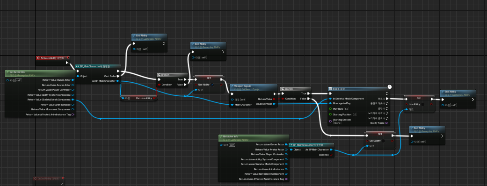
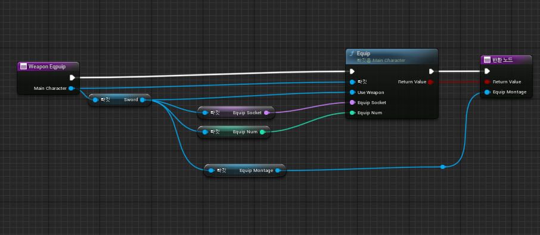

#### 방어 개선
+ 방어 어빌리티를 Block, BlockEnd 두개로 나눠서 구현 하였으나 WainInputRelease() 함수를 이용하여 키가 떼졋을때를 추가 구현하여 Block어빌리티에 통합 하였음
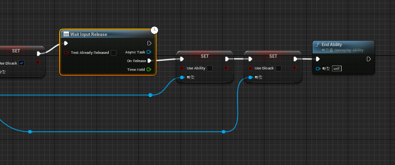
+ 이로 인하여 기존의 방어상태에서 달리기 키를 방어자세가 풀리는 오류를 고침

### 콤보 공격 구현(03/16)
+ 기존 사용하던 코드에서 State를 체크하는 조건을 지우고 좀더 간략하게 재구성, 애니메이션 부분은 추가사항 없음.

```cpp
void AMainCharacter::LMBDawn()
{
	if (!bUseAbility && !IsDodge) //회피 중이 아니고, 어빌리티 사용 중이 아닐때 작동
	{
		if (CurrentWeapon != nullptr) //무기를 장착 해야지 작동
		{
			bCanUseAbility = false; //어빌리티 사용 불가로 변경
			if (!(MainAnimInstance->Montage_IsPlaying(CurrentWeapon->GetAttackMontage()))) // 몽타주가 실행중이 아니면 처음 공격, 아니면 콤보 공격으로 판단
			{
				Attack();
				IsAttack = true;
			}
			else
			{
				IsCombo = true; //콤보 중으로 변경
			}
		}
	}
}

void AMainCharacter::Attack()
{
	if (MainAnimInstance == nullptr) { return; }
	MainAnimInstance->PlayAttack(CurrentCombo);
	//UE_LOG(LogTemp, Warning, TEXT("Combo: %d"), CurrentCombo);
}

// 공격 종료 함수 -> 콤보 여부, 공격 여부를 false로 변경, 현제 콤보 초기화 및 어빌리티 사용 가능 상태로 변경 -> 노티파이를 통해 호출 
void AMainCharacter::AttackEnd()
{
	IsCombo = false;
	CurrentCombo = 1;
	IsAttack = false;
	bCanUseAbility = true;
}

// 콤보 체크용 함수 -> 노티파이를 통해 호출
void AMainCharacter::CheackCombo()
{
	if (CurrentCombo >= MaxCombo)
	{
		CurrentCombo = 1;
	}
	if (IsCombo == true)
	{
		CurrentCombo += 1;
		IsCombo = false;
		Attack();
	}
}
```

### 스킬 구현(03/17)
+ #### AbilitySystem을 이용하여 스킬 시스템을 구현함
+ #### 무기에 E,Q 스킬창에 올려놓을수 있는 모든 스킬을 저장하는 배열인 ESkills와 QSkills 변수를 만들고, 실제로 사용하는 스킬 UseE(Q)Skills를 생성, 게임 시작시 자동으로 배열의 첫번째 요소가 각각 들어가도록 구현함 -> 후에 UI작성시 다른 스킬도 지정할수 있게 할 예정.

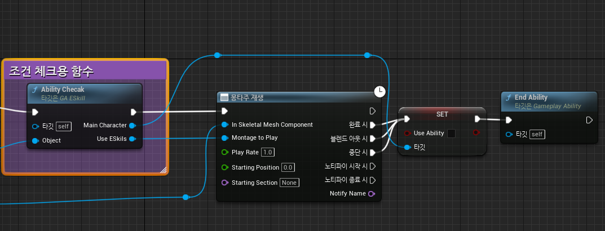

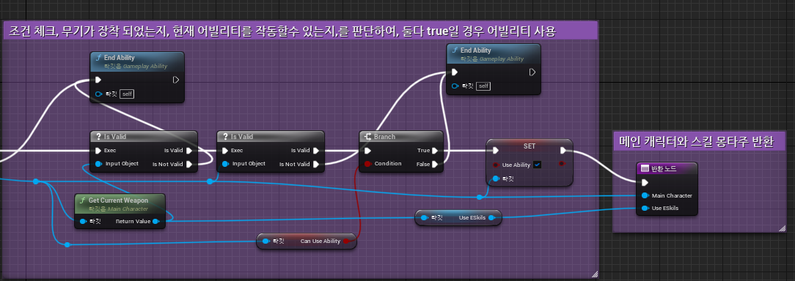

### EP 및 MaxEP 설정, EPSkill(특수 스킬)기초 구현(03/20)
+ ### CharacterAttributeBase에 EP(속성치), MaxEP(최대 속성치)를 지정하여 에디터에서 각각 0, 100으로 초기화 함

```cpp
//속성치 설정
UPROPERTY(BlueprintReadOnly, Category = "Abilities", ReplicatedUsing = OnRep_EP)
FGameplayAttributeData EP;
ATTRIBUTE_ACCESSORS(UCharacterAttributeSetBase, EP)

//최대 속성치 설정
UPROPERTY(BlueprintReadOnly, Category = "Abilities", ReplicatedUsing = OnRep_MaxEP)
FGameplayAttributeData MaxEP;
ATTRIBUTE_ACCESSORS(UCharacterAttributeSetBase, MaxEP)

//속성치 설정
void UCharacterAttributeSetBase::OnRep_EP(const FGameplayAttributeData& OldEP)
{
	GAMEPLAYATTRIBUTE_REPNOTIFY(UCharacterAttributeSetBase, EP, OldEP);
}

//최대 속성치 설정
void UCharacterAttributeSetBase::OnRep_MaxEP(const FGameplayAttributeData& OldMaxEP)
{
	GAMEPLAYATTRIBUTE_REPNOTIFY(UCharacterAttributeSetBase, MaxEP, OldMaxEP);
}
```

+ ### EPSkills Ability블루프린트를 만들어서, 기초적인 EP수치 확인과, 작동을 구현 함.
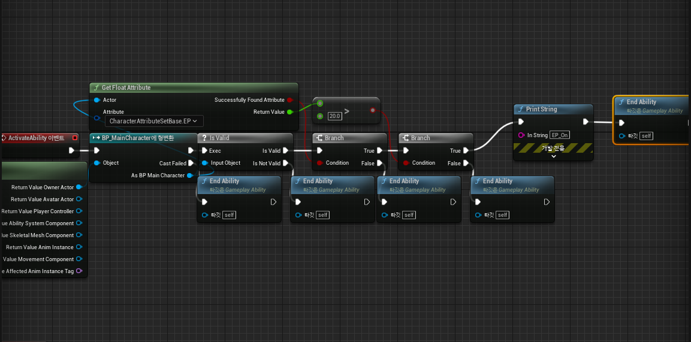

### EP스킬 제작 및 스킬사용 구현(03/21)
+ #### Weapon class에 EPSkill 몽타주를 변수로 할당하고, EPSkills Ability에서 조건에 부합할시, 해당 무기의, EPSkill을 사용하도록 구현함.

### Ability 사용을위한 조건문 코드 개선 및 방패 효과 추가(03/22)
+ #### Ability 사용을위한 조건문 코드 개선: 기존 블루프린트에서 조건을 확인하는 작업을 C++로 구현하여, 보기 쉽개 정리함.

```cpp 

bool AMainCharacter::CheackCanUseAbility() const //bCanUseAbility를 확인하여 현제 어빌리티 사용 가능 여부를 반환 함
{
	if (bCanUseAbility)
	{
		return true;
	}
	else
	{
		return false;
	}
}

AWeapon* AMainCharacter::CheackCanUseSkillAbility() const // 현제 무기여부 및 Ability사용 여부를 검사하여 현제 무기를 장비중이고 Ability를 사용 가능하면 무기 반환.
{
	if (CheackCanUseAbility() && CurrentWeapon != nullptr)
	{
		return CurrentWeapon;
	}
	else
	{
		return nullptr;
	}
}
```

+ ####  방패 효과 추가: 방어를 사용할려고 할때 방패가 커지는 효과를 추가하여, 기본 상태일때는 작게 방어 상태일때는 커지도록 구현, 사운드 추가.


### 두번째 무기(도끼) 구현 및 장착 구현(03/23)
+ #### 두번째 무기인 도끼를 WeaponClass에서 파생하어 블루프린트로 제작 함.
+ #### 도끼를 사할때 다른 무기를 사용 중이면 이미 사용 중인 무기는 장착을 해제하고, 도끼를 장착함.
+ #### 도끼를 들었을때의 애니메이션을 추가함

### 두번째 무기 일반스킬 및 콤보 공격 애니메이션 구현(03/24)
+ #### 두번째 무기에 사용할 Q, E 일반 스킬 애니메이션 구현
+ #### Paragon의 Terra캐릭터의 애니메이션과, 카이메라의 애니메이션을 사용하여 콤보공격, 일반스킬을 구현하고 이펙트를 추가함.

### 두번째 무기 특수 스킬 및 이펙트 추가(03/27)
+ #### Paragon에셋을 이용하여 특수 스킬 및 이펙트를 추가함

### 기본EnemyClass 제작 및 애님인스턴스, 기초 스텟 설정(03/28)
+ #### 기본EnemyClass 제작 -> BaseCharacter를 상속 받아서 제작, 기본적인 생성자 및 Tick, BeginPlay함수만 정의 함
+ #### 애님인스턴스 제작 -> MainCharacter와 동일하게, AnimInstace class를 상속받아 구현, 속도와, 이동방향을 구해, 변수로 저장함.
+ #### 기초 스텟 설정 -> Enemy용 DefultGameplayEffect를 제작, 체력과 최대 채력만 설정 함.

### Enemy RandomPatrol 구현(03/29)
+ #### AI제작을 위해, EnemyController와 비헤이비어트리, 블랙보드를 이용하여, 맵상의 랜덤한 위치로 이동하는 RandomPatrol을 구현함
+ #### EnemyController에 AIPerception컴포넌트를 통해, 플레이어를 인지 할수 있게 구현.

EnemyController.h

```cpp
UCLASS()
class MYGAME_API AEnemyController : public AAIController
{
	GENERATED_BODY()
private:
    UPROPERTY(EditDefaultsOnly, BlueprintReadWrite, Category = "AI", meta = (AllowPrivateAccess = "true"))
    class UBehaviorTree* BehaviorTree; //비헤이비어 트리 에셋

    UPROPERTY(EditInstanceOnly, BlueprintReadOnly, Category = "AI", meta = (AllowPrivateAccess = "true"))
    class UBehaviorTreeComponent* BehaviorTreeComponent; //비헤이비어트리 컴포넌트

    UPROPERTY(VisibleAnywhere, BlueprintReadOnly, Category = "AI", meta = (AllowPrivateAccess = "true"))
    class UBlackboardComponent* BlackboardComponent;    //블랙보드 컴포넌트

    class UAISenseConfig_Sight* SightConfig;

public:
    //블랙보드 키에 접근시 사용할 이름들
    static const FName TargetLocation;
    static const FName CanSeePlayer;

    //AI Perception 변수
    UPROPERTY(EditAnywhere, BlueprintReadWrite)
    float AISightRadius = 500.f;
    UPROPERTY(EditAnywhere, BlueprintReadWrite)
    float AILoseSightRadius = 50.f;

    UPROPERTY(EditAnywhere, BlueprintReadWrite)
    float AIFieldOfView = 90.f;
    UPROPERTY(EditAnywhere, BlueprintReadWrite)
    float AISightAge = 1.f;
    UPROPERTY(EditAnywhere, BlueprintReadWrite)
    float AILastSeenLocation = 100.f;

    //------------------------Function-----------------------//
   UFUNCTION()
    void OnUpdated(TArray<AActor*> const& updated_actors);
    UFUNCTION()
    void OnTargetDetected(AActor* actor, FAIStimulus const Stimulus);
    UFUNCTION()
    void SetPerceptionSystem();

    AEnemyController(); //생성자

    //블랙보드 컴포넌트 반환
    FORCEINLINE UBlackboardComponent* GetBlackboardComponent() const { return BlackboardComponent; }

protected:
    void BeginPlay()override;
    virtual void OnPossess(APawn* InPawn) override;     //폰 빙의시 호출 되는 함수
```

EnemyController.cpp

```cpp

//접근할 이름에 블랙보드 키값 할당
const FName AEnemyController::TargetLocation(TEXT("TargetLocation"));
const FName AEnemyController::CanSeePlayer(TEXT("CanSeePlayer"));

AEnemyController::AEnemyController()
{
	BehaviorTreeComponent = CreateDefaultSubobject<UBehaviorTreeComponent>(TEXT("BehaviorTreeComponent"));
	BlackboardComponent = CreateDefaultSubobject<UBlackboardComponent>(TEXT("BlackboardComponent"));

	SetPerceptionSystem();
}

void AEnemyController::BeginPlay()
{
	Super::BeginPlay();
	if (IsValid(BehaviorTree))
	{
		RunBehaviorTree(BehaviorTree);
		BehaviorTreeComponent->StartTree(*BehaviorTree);
	}
}

void AEnemyController::OnPossess(APawn* InPawn)
{
	Super::OnPossess(InPawn);
	if (IsValid(Blackboard) && IsValid(BehaviorTree))
	{
		Blackboard->InitializeBlackboard(*BehaviorTree->BlackboardAsset); //블랙보드 키값 초기화 실시
	}
}

void AEnemyController::OnUpdated(TArray<AActor*> const& updated_actors)
{
	UE_LOG(LogTemp, Warning, TEXT("Updating"));
}

void AEnemyController::OnTargetDetected(AActor* actor, FAIStimulus const Stimulus)
{
	if (auto const player = Cast<AMainCharacter>(actor))
	{
		//성공적으로 감지하면 블랙보드에 true값을 넣어준다.
		GetBlackboardComponent()->SetValueAsBool(CanSeePlayer, Stimulus.WasSuccessfullySensed());
	}
}

//PerceptionComponent 초기화 담당 함수
void AEnemyController::SetPerceptionSystem()
{
	//PerceptionComponent할당 및 주요 감지 설정
	PerceptionComponent = CreateDefaultSubobject<UAIPerceptionComponent>(TEXT("AIPerception Component"));
	SightConfig = CreateDefaultSubobject<UAISenseConfig_Sight>(TEXT("Sight Config"));
	PerceptionComponent->ConfigureSense(*SightConfig);
	PerceptionComponent->SetDominantSense(SightConfig->GetSenseImplementation());

	//시야 범위, 각도등 기초 정보 설정
	SightConfig->SightRadius = AISightRadius;
	SightConfig->LoseSightRadius = SightConfig->SightRadius + AILoseSightRadius;
	SightConfig->PeripheralVisionAngleDegrees = AIFieldOfView;
	SightConfig->SetMaxAge(AISightAge);
	SightConfig->AutoSuccessRangeFromLastSeenLocation = AILastSeenLocation;

	//감지할 객체 정보(적, 중립, 아군)
	SightConfig->DetectionByAffiliation.bDetectEnemies = true;
	SightConfig->DetectionByAffiliation.bDetectNeutrals = true;
	SightConfig->DetectionByAffiliation.bDetectFriendlies = true;

	//주요 감지 능력 설정
	PerceptionComponent->SetDominantSense(*SightConfig->GetSenseImplementation());

	//함수 바인딩
	PerceptionComponent->OnPerceptionUpdated.AddDynamic(this, &AEnemyController::OnUpdated);
	PerceptionComponent->OnTargetPerceptionUpdated.AddDynamic(this, &AEnemyController::OnTargetDetected);
}
```

+ #### 블랙보드와 비헤이비어를 통하여 실질적인 AI 를 관리함.

블랙보드

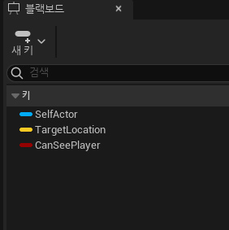

비헤이비어 트리

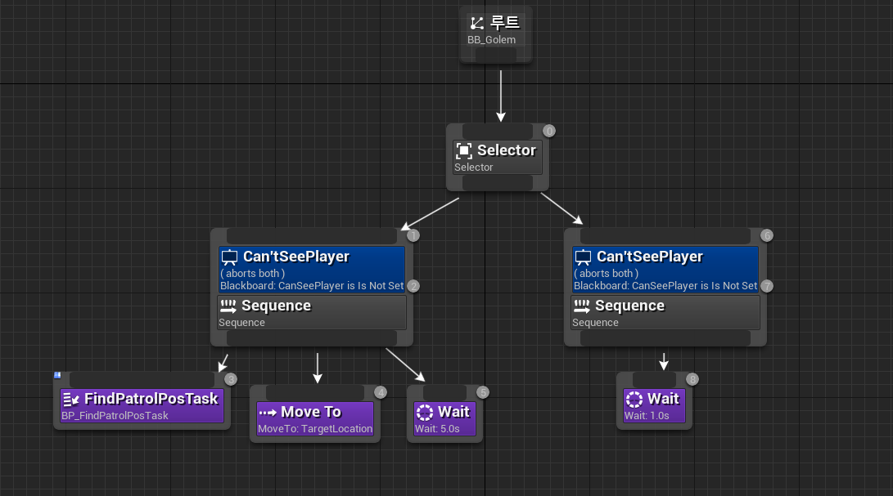

+ #### RandomPatrol: 맵상의 랜덤 좌표를 지정하여, 블랙보드에 기입.

```cpp

UFindPatrolPosTask::UFindPatrolPosTask(FObjectInitializer const& object_initializer)
{
	NodeName = TEXT("FindPatrolPosTask");
}

EBTNodeResult::Type UFindPatrolPosTask::ExecuteTask(UBehaviorTreeComponent& OwnerComp, uint8* NodeMemory)
{
	auto Controller = Cast<AEnemyController>(OwnerComp.GetAIOwner());
	auto Enemy = Controller->GetPawn();

	if (nullptr == Enemy) 
	{
		return EBTNodeResult::Failed;
	}
	//현재 에디터에 설정된 navi mesh로 초기화
	UNavigationSystemV1* const NavSystem = UNavigationSystemV1::GetCurrent(GetWorld());

	if (nullptr == NavSystem) 
	{
		//navi mesh가 없다면 실패를 반환
		GEngine->AddOnScreenDebugMessage(-1, 5.f, FColor::Red, TEXT("No Enemy in Navi"));
		return EBTNodeResult::Failed;
	}

	FVector const Origin = Enemy->GetActorLocation();
	FNavLocation NextPatrol;

	//NextPatrol변수에 임의의 location 데이터를 넣고 다시 TargetLocation키의 value에 값을 넣어준다.
	if (NavSystem->GetRandomPointInNavigableRadius(Origin, SearchRadius, NextPatrol))
	{
		Controller->GetBlackboardComponent()->SetValueAsVector(AEnemyController::TargetLocation, NextPatrol.Location);
	}

	FinishLatentTask(OwnerComp, EBTNodeResult::Succeeded);
	return EBTNodeResult::Succeeded;
}

```

### 플레이어 추적 구현(03/30)
+ #### 플레이어 추적 구현: 블랙보드에 Player 오브젝트 키를 추가함. cpp의 OnTargetDetected()에서 플레이어가 탐지 되면, Player키에 플레이어캐릭터를 저장, 해당 객체 위치로 이동하는 AI 구현함.

```cpp

void AEnemyController::OnTargetDetected(AActor* actor, FAIStimulus const Stimulus)
{
	if (auto const PlayerPawn = Cast<AMainCharacter>(actor))
	{
		//성공적으로 플레이어를 감지 하면 true값을 넣어준다.
		GetBlackboardComponent()->SetValueAsBool(CanSeePlayer, Stimulus.WasSuccessfullySensed());
		
		//CanSeePlayer가 true면 플레이어를 감지 한것 이고 false면 감지 하지 못한 것으로 판단함. 
		if (GetBlackboardComponent()->GetValueAsBool(CanSeePlayer))
		{
			// Player 에 플레이어 캐릭터 저장 및 이동 속도 증가
			GetBlackboardComponent()->SetValueAsObject(Player, PlayerPawn);
			AEnemy* Enemy = Cast<AEnemy>(GetPawn());
			Enemy->GetCharacterMovement()->MaxWalkSpeed = 550.f;
		}
		else
		{
			// 플레이어가 감지 범위 밖으로 나갔거나, 감지 하지 않은 것이므로 Player에 nullptr저장 및 이동속도 감소
			GetBlackboardComponent()->SetValueAsObject(Player, nullptr);
			AEnemy* Enemy = Cast<AEnemy>(GetPawn());
			Enemy->GetCharacterMovement()->MaxWalkSpeed = 300.f;
		}
	}
}

```

+ #### 비헤비어 트리
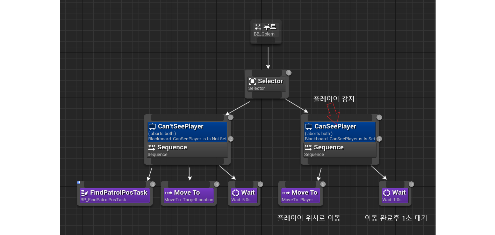


### 충돌 처리 방식 고안(04/03)
+ #### BoxComponent를 사용 하는 방식은 세세한 충돌 처리를 하는데 불편함이 있음, 몬스터의 실제 크기와 콜리전의 크기가 정확하게 맞지 않음, 몬스터의 신체 부위에 다른 형태의 콜리전을 적용 해야 할 수도 있고, 몬스터의 종류마다 다른 형태를 적용 해야 할수도 있음, 이를 한번에 처리할 방식을 고안 해야 함.
+ + #### 1. ComponentTag를 사용 하여 무기와 충돌한 객체를 검사 -> 충돌한 콜리전에 많을수록 검사하는데 시간이 걸릴 것으로 예상, 이게임은 타격감과 전투가 중요한 만큼, 충돌처리의 세세한 판정이 필요, 시간이 걸릴 수록 피격 판정이 원래 예상 했던 것에 비헤 늦어질수도 있음 -> 플레이어 불쾌감을 줄지도 모름 -> 기각
+ + #### 2. OverlapComponent 함수 사용 -> 원하는 위치에 원하는 크기만큼의 충돌을 줄수 있으나, 결국 배열을 통해 하나 하나 전부 체크하는 방식 -> 기각
+ + #### 3. C++에서 OverlapMultiByChannel함수를 통해 구현 -> 프로젝트 세팅에서 트레이스만 추가하고, 지정해주면 모든 형태의 콜리전에서 검사 가능, 원하는 모양대로 충돌 판정을 만들수 있음 -> 해당 방식을 사용하여 구현 할 예정

+ ### 3번 방식 구현 방법 요약 정리
+ + #### 1. 에디터에서 트레이스 채널 추가
+ + #### 2. C++에서 OverlapMultiByChannel함수를 이용하여 충돌한 객체가 있는지 확인하는 bool 형 함수 구현
+ + #### 3. AnimNotify에서 2에서 만든 함수를 호출 -> 공격이 이루어지는 시기에만 작동 하도록 구현
+ + #### 4. 충돌 판정이 나면 GameplayEffect를 통해 몬스터의 HP를 감소 시킴

### 스킬 충돌 및 데미지 판정(04/04)
+ #### 순서: 충돌 판정 -> 에디터에 공격 충돌용 Trace채널 추가 -> 콜리전 프리셋에 CombetCollision프리셋을 추가하고, Enemy캐릭터의 팔, 다리 몸통 등 형태에 맞는 콜리전을 추가하고, CombetCollision으로 프리셋을 설정(해당 프리셋은 오직 공격 충돌용 Trace에만 반응함.) -> 공격 중 AnimNotify에서 AttackHandle이벤트를 호출하여, 해당 무기의 충돌 판정을 실시 -> 충돌이 일어나면 충돌이 일어난 객체의 정보와, 플레이어 객체를 묶어서 이벤트로 보냄 -> 스킬 Ability는 몽타주 재생후 이벤트가 들어오는것을 기다리다가 들어오면 데미지를 적용함.

+ #### 
-> AnimNotify에서 호출되는 이벤트로, 현제 무기가 유효한지 확인후 유효하면, 해당무기의 충돌 체크 함수를 호출 함.
+ #### 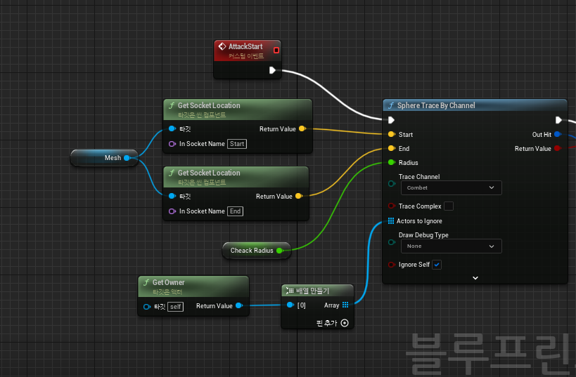
-> SphereTraceByChanel함수를 통하여 검의 일정 부분을 감싸는 구형체의 범위를 지정하여 해당 Trace가 충돌한 객체 및 충돌 정보를 구조체로 반환함
+ #### 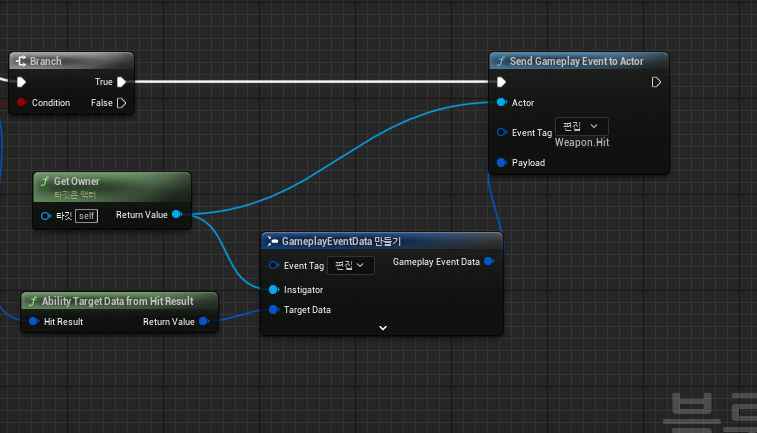
-> 위에서 반환된 구조체 있을 경우 해당 구조체와 공격한 객체(플레이어)의 정보를 GameplayEvent로 묶어서 스킬Ability가 받을수있게 이벤트를 보냄 
+ #### 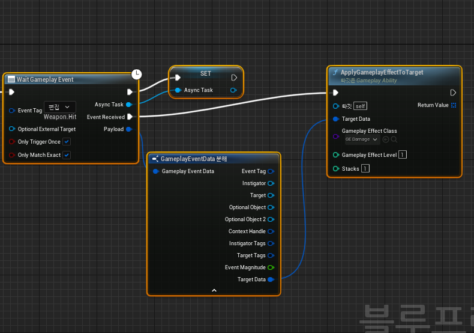
-> 스킬에서 이벤트가 전달된것이 확인 되면 GE_Damage를 이용하여 Enemy의 체력을 20 감소 시킴

### 일반공격 Ability 재 구현 및 데미지 판정(04/05)
+ #### 일반공격을 AbilitySystem으로 재작성 하여 구현함.
+ #### 데미지 처리 방식은 스킬과 같은 방식으로 작동

+ #### 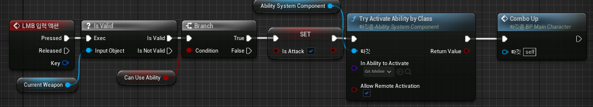
-> 마우스 좌클릭시 이벤트가 호출되어, 현재 무기를 장착 하였는지, 어빌리티 사용 가능한지 확인후, isAttack 을 true로 변경하여 현제 공격중으로 알리고 어빌리티를 작동, 그후 콤보 수치를 +1 함
+ #### 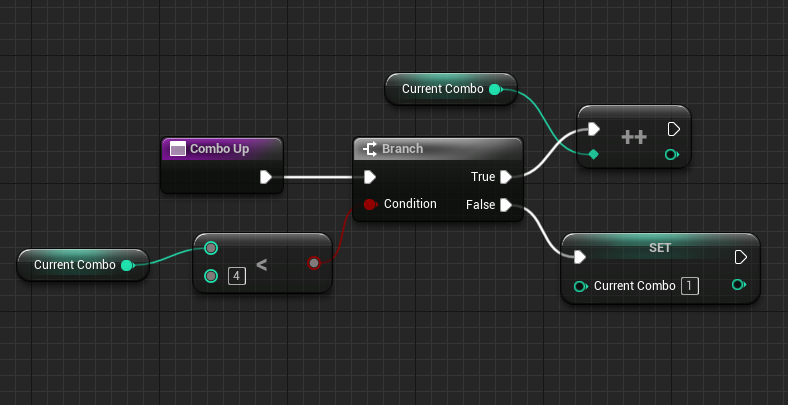
-> 콤보수치를 +1 하는 함수 최대 횟수보다 크면 초기화 해주고 아니면 콤보 수치를 +1 함
+ #### 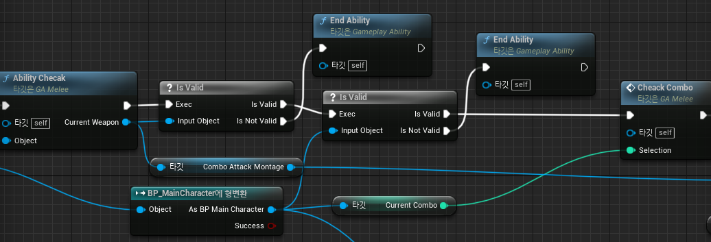
-> 실제 공격이 작동 되는어빌리티로 해당 어빌리티가 작동되면, 현재 어빌리티 사용 가능 여부를 확인하고, 현재 콤보를 확인 함
+ #### 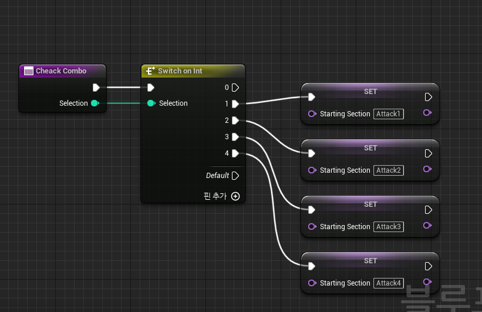
-> 현재 콤보 수치에 따라 애니메이션몽타주의 색션을 StartingSection에 저장 

### Enemy 피격모션 구현(04/06)
+ #### GameplayCue에 TookDamage를 추가하여, 데미지가 들어가는 GameplayEffect GE_Dagame에 연결하여 사용함
+ #### 피격 애니메이션 재생 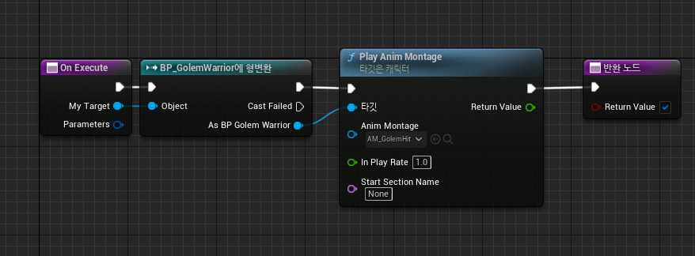
+ #### GameplayEffect에 GameplayCue연결 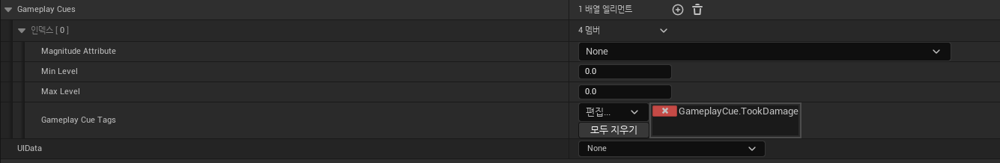

### 공격 범위 설정 및 전투 <-> 추적 변환 구현(04/10)
+ #### 공격 범위 확인을 위한 BT_Service 구현, 이름을 IsInAttackRange로 하고 플레이어를 추적 하는 상태일때 범위 안에 들어오면 전투 상태로 변경 함.
+ #### 추가적으로 적의 시야 범위를 늘려 추적상태와 전투 상태가 구별 되도록 구현함.

IsInAttackRange

```cpp

UInAttackRange::UInAttackRange()
{
	NodeName = TEXT("InAttackRange"); //표시되는 노드 이름
	Interval = 0.05f; //반복 주기
}

void UInAttackRange::TickNode(UBehaviorTreeComponent& OwnerComp, uint8* NodeMemory, float DeltaSeconds)
{
	Super::TickNode(OwnerComp, NodeMemory, DeltaSeconds);

	APawn* ControllingPawn = OwnerComp.GetAIOwner()->GetPawn(); // ControllingPawn에 현제 조종하는 Pawn 저장
	if (ControllingPawn == nullptr)
	{
		return;
	}
	UWorld* World = ControllingPawn->GetWorld();
	FVector Center = ControllingPawn->GetActorLocation(); //후에 사용할OverlapMultiByChannel에서 사용할 중점을 적 캐릭터의 좌표로 설정
	float AttackRange = 300.0f;

	if (World == nullptr)
	{
		return;
	}

	TArray<FOverlapResult> OverlapResults; //오버랩 결과
	FCollisionQueryParams CollisionQueryParam(NAME_None, false, ControllingPawn);
	bool bResult = World->OverlapMultiByChannel
	(
		OverlapResults,
		Center,
		FQuat::Identity,
		ECollisionChannel::ECC_GameTraceChannel2,
		FCollisionShape::MakeSphere(AttackRange),
		CollisionQueryParam
	);

	if (bResult)
	{
		for (auto const OverlapResult : OverlapResults)
		{
			AMainCharacter* Main = Cast<AMainCharacter>(OverlapResult.GetActor());
			AEnemy* Enemy = Cast<AEnemy>(OwnerComp.GetAIOwner()->GetPawn());
			if (Main && Main->GetController()->IsPlayerController())
			{
				OwnerComp.GetBlackboardComponent()->SetValueAsBool(AEnemyController::IsInAttackRange, true);
				return;
			}
		}
	}
	else
	{
		UE_LOG(LogTemp, Warning, TEXT("Out"));
		OwnerComp.GetBlackboardComponent()->SetValueAsBool(AEnemyController::IsInAttackRange, false);
	}
	DrawDebugSphere(World, Center, AttackRange, 16, FColor::Red, false, 0.2f);
}

```
+ #### AI비헤이비어 트리
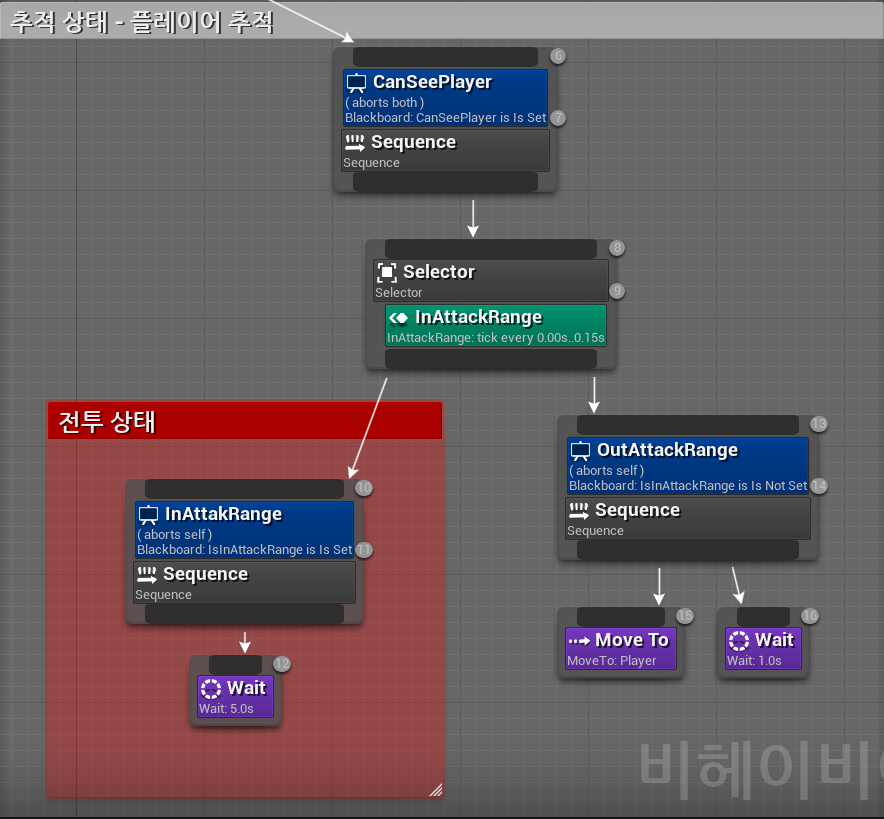

### 공격 AI 기초 로직 구현(04/11)
+ #### 공격 및 근접 패턴에서 사용할 AI의 기초 로직을 구현함 -> 현제는 공격 범위 안에 들어오면 자동으로 공격을 1번 하도록 간단하게 구현함
+ #### Enemy 클래스에 일반 공격에 해당하는 ComboAttackMontage와 근접 패턴인 MeleePatternMontage변수를 추가하고 에디터에서 애니메이션 지정

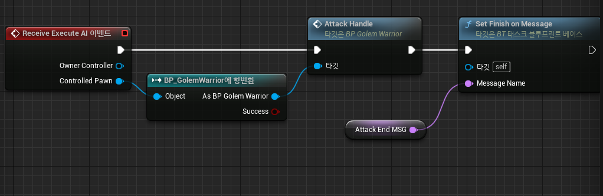

->AI에서 공격을 호출하면 Enemy_BP에서 커스텀 이벤트인 AttackHandle을 호출함, 그후 공격 종료 Message가 올때 까지 대기

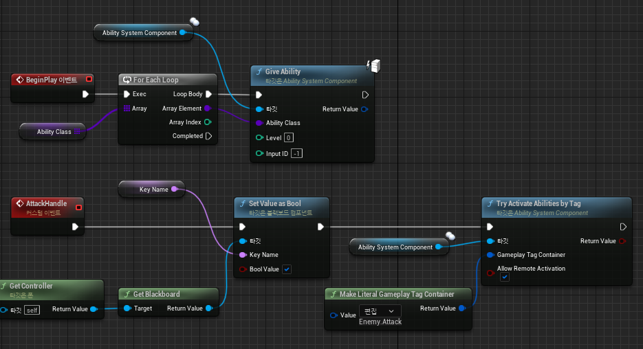

-> 호출되면 현제 블랙보드에 공격중을 표시하고 Enemy.Attack 태그를 가진 어빌리티를 작동 시킴

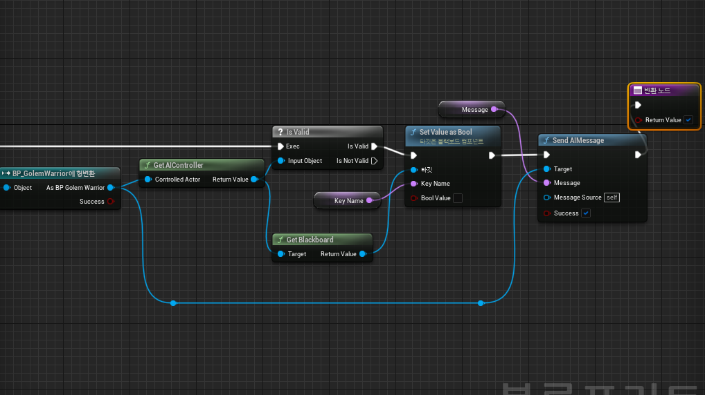

-> 공격 애니메이션의 끝부분에서 블랙보드에 공격 중을 false로 지정하고 공격 종료 Message를 보냄

+ #### 공격Ability는 메인캐릭터외 유사하여 생략 함.

### 콤보 공격 패턴 완성(04/12)
+ #### 몬스터가 콤보 공격을 사용하는 패턴을 완성 함, Enemy Class에 콤보 증가 함수와, 피격시 콤보를 초기화 하는 함수, 현제 콤보에 맞는 애니메이션을 반환 하는 함수를 제작함

```cpp

/// FORCEINLINE은 헤더 파일에서 Inline 함수로 사용하는 메크로 이다.
/-----------------------------헤더 파일----------------------------------/
FORCEINLINE void ComboReset() { ComboNum = 0; } //콤보 초기화 함수
/-----------------------------헤더 파일----------------------------------/

// 콤보 증가 함수
void AEnemy::ComboUp()
{
	ComboNum ++;

	if (ComboNum > 2)
	{
		ComboNum = 0;
	}
}

// 현제 콤보에 맞는 애니메이션 반환
UAnimMontage* AEnemy::GetCurrentCombo()
{
	switch (ComboNum)
	{
	case 0:
	{
		CurrentComboAttackMontage = ComboAttackMontage[0];
		break;
	}
	case 1:
	{
		CurrentComboAttackMontage = ComboAttackMontage[1];
		break;
	}
	case 2:
	{
		CurrentComboAttackMontage = ComboAttackMontage[2];
		break;
	}
	default:
		break;
	}
	return CurrentComboAttackMontage;
}

```

+ #### 그 후 04/11에 제작한 어빌리티 및 AnimNofity에 추가하여, 콤보공격을 제어 함.

### 2번째 근접 공격 패턴 추가(04/13)
+ #### 랜덤한 패턴을 작동 하는 AI패턴을 구현하였고 추가로 근접 공격 패턴을 구현하였음.

#### EnemyClass

```cpp

void AEnemy::RandomPattern()
{
	int x = 0;	//랜덤한 숫자를 저장할 변수
	x = FMath::RandRange(1, 100);		// 랜덤 값 저장

	if (x <= 60)
	{
		Controller->GetBlackboardComponent()->SetValueAsEnum(Controller->AttackPattern, 1);
	}
	else if (x <= 100)
	{
		Controller->GetBlackboardComponent()->SetValueAsEnum(Controller->AttackPattern, 2);
	}
}

```

-> 해당 x값에 따라 AttackPattern이라는 이름의 열거형에 저장된 값을 블랙보드에 기입, 해당 값에따라 AI가 패턴을 작동 하도록 구현함.

#### AI비헤이비어 트리

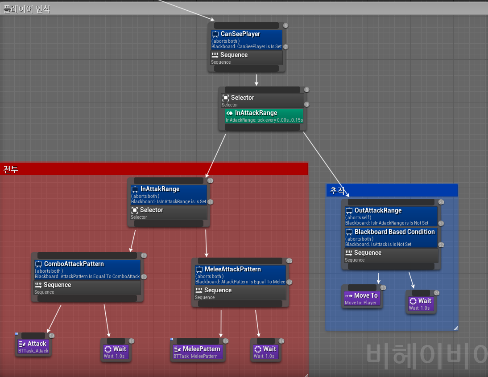


### 3번째 근접 공격 패턴 추가(04/14)
+ #### 2가지 패턴만 사용하는 AI는 너무 단조 롭다고 느낌 따라서 추가로 1개의 공격 패턴을 추가 함.

### 적 캐릭터 공격 판정 추가(04/17)
+ #### Weapon Class에 사용했던 충돌판정 기능을 사용 하여 제작, 현제 플레이어 캐릭터의 캡슐 콜리전에 충돌하게 설정, 후일에 데미지 처리및 애니메이션 출력을 구현함

### 플레이어 캐릭터 데미지 판정 추가(04/18)
+ #### GameplayCue에 PlayerTookDamage를 추가하여, 플레이어가 데미지를 입는 GameplayEffect 구현

### 플레이어 방어 구현(04/19)
+ #### 현재 플레이어가 방어 중 이면 OwnerTag에 Sheild.Block Tag가 할당되기 때문에 충돌 처리후 플레이어 캐릭터의 OwnerTag를 검사하여 Sheild.Block Tag가 있으면 방어 애니메이션을 출력 함.

### 플레이어 패링 구현(04/27)
+ #### 플레이어가 방어를 사용하면, GameplayTag에 Player.Parriable 태그가 추가되고, 2초후 제거 됨, 이때 공격을 받으면, 패링 모션과 함께, 플레이어의 EP가 차오르는 GameplayEffect를 제작함.

### 범위형 공격 데미지 처리 구현, 페링 시 적 움찔 에니메이션 추가(05/01)
+ #### 플레이어의 특수스킬은 범위형 스킬 이므로, 일정 원을 충돌 처리 부분으로 지정하여 데미지 처리를 실시함, 추가로 적의 공격에 페링을 성공 시 적이 움찔거리는 애니메이션 추가. 

### 플레이어, 적 기절 및 죽음 구현(05/02)
+ #### 플레이어의 기절, 및 죽음에 해당하는 player.Strun과 player.Die Tag를 추가하고, 특정 조건에 맞으면, Tag를 추가하고, 기절 및 사망 애니메이션을 작동 시킴
+ #### 적 기절 및 죽음은 AI비헤이비어 트리에서 제어하여, 해당 조건을 검사 후 실행, Die판정일 경우 AI작동을 중지 함

### 방어 및 페링 이펙트 추가 및, 스킬 공격 시 EP충전 구현(05/03)
+ #### 방어 및 페링 성공시, 이펙트 및 사운드를 추가함
+ #### E, Q 키를 사용해 공격 시, 적이 피격하면 EP를 충전하도록 EPCharge Effect를 호출 함.

### 보스 캐릭터 기초 제작(05/04)
+ #### BaseEnemy를 상속 바다 Boss 블루 프린트 생성, 기초적인 AI 설정 및, Default GameplayEffect를 설정 하여, 체력 및 과부화 수치를 정함.
+ #### Boss캐릭터는 Pargon 캐릭터의 오로라 캐릭터를 사용 
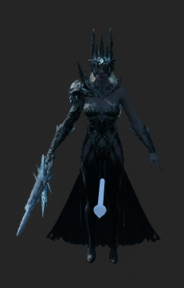


---

## 12 버그 및 개선 사항

### 애니메이션 에셋 오류 발생(23.01.06) -> 해결 (23.01.08)
+ #### 문제점: 현제 사용할려는 애니메이션과 캐릭터 에셋간의 스켈레톤 구조가 매우 다름, 리타겟팅을 써도 사용 불가, 새로운 캐릭터 에셋 및 애니메이션을 사용 해야 함,
+ #### 해결 사용할려는 애니메이션에 제일 비슷한 구조를 가진 pragon에셋을 사용하도록 결정, 추가로 프로젝트 파일 정리 실시.
---

### 회피 시점 오류 발생(01/13) -> 1차 개선(01/13) -> 2차 오류 발생(01/14) -> 2차 개선(01/15)
+ #### 문제점: 회피하면서 카메라 시점을 회전하면 캐릭터도 그에 맞게 회전됨 -> 후에 Idle 상태를 추가하여 이동 입력이 들어오면 Move로 바꾸고 이 경우에만 카메라 시점이 회전하면 캐릭터가 회전 하도록 수정 해볼 것
+ #### 1차 개선: Enum에 Idle 상태를 추가하여 Move(이동), Dodge(회피), Idle(대기)3가지의 상태를 만들어 각각 해당하는 입력에 따라 캐릭터의 bUseRotatuonYaw값을 수정 하도록 설계

### 2차 오류 발생
+ #### 문제점: 회피는 BindAction이고 움직임은 BindAxis라 서로 작동 방식이 미세하게 다름, 따라서 움직임키에 BindAction할 이벤트를 새로 작성하여 구현, Move -> Dodge -> Idel의 상태 변화에는 성공 하였음, 그러나 회피후 이동 키를 다시 한번 눌러야 하는 점이나, 사선 이동 -> 직선 이동으로 변경시 이동이 끊기는 상황이 생겨, 해당 안은 폐기함
+ #### 2차 개선(01/15): Enum에 따로 추가하지않고 기본상태를 Move로, 회피 시에만 Dodge상태로 바꾸며 이때 직접적으로, bUseRotatuonYaw값을 수정하여 회피시에 카메라 회전에 따라 캐릭터의 이동을 막음 -> 생각한 이동 방식 적합하다고 판단하여 해당 방식으로 구현함

#### 클래스 개선(01/15)
+ #### MainCharacter.h에 있던 ENum을 MainState에서 MoveState로 이름을 변경, BaseCharacter.h로 위치를 이동
+ #### -> 이유: 후에 몬스터도 해당 ENum을 사용하여 상태를 조절 할 예정, 따로 추가하는 것보단 같은 부모 클래스에 작성하는 것이 효율적이라고 판단.

---

### 공격 오류 발생(02/02) -> 해결 (02/03)
+ #### 문제점: 무기 장착 여부에 관계없이 공격 키만 누르면 공격이 작동됨, 또한 무기와 공격애니메이션 간의 연결점이 없어 따로 따로 설정 해야함, 
+ #### 무기 장착 여부를 확인 하기 위한 CurrentWeapon변수를 추가함,
+ #### 회피 도중 공격 키를 눌르면 회피를 멈추고 공격을 하는 문제점 확인 -> 회피 도중에 공격을 할수 없게 조건을 추가하여 개선
+ #### 같은 방식으로 방어 상태에서 애니메이션이 겹쳐는 문제 발생 하여 이 부분도 추작적인 조건문을 사용하여 개선 함

---

### 콤보 공격 개선(04/07) -> 해결(04/07)
+ #### 콤보 공격을 Ability로 구현 하였으나, 공격기능이 어색하고, 의도치 않은 방식으로 작동 되는 것을 확인함
+ #### 해결 법: Youtube에서 "UE備忘録本舗" 라는 사람이 올린 동영상을 보고 해당 방식을 인용하여 사용 하기로 함
+ #### 사이트URL: https://www.youtube.com/watch?v=e7btrlL5Kas&t=1705

---

### 피격시 플레이 및 몬스터 정지 버그 발견(04/20)
+ #### 피격시 일반 공격을 하면 회피와 움직이는것 말고는 모든 입력이 막힘 -> 해결(04/26)
+ #### 피격시 몬스터의 AI가 정지하는 현상 발견 -> (04/28)
+ #### 전투 시스템의 개선이 필요
+ #### 04/24 플레이어 일반 피격 개선: GA_Hit Ability를 사용하여, 몽타주가 재생 되는 동안 Player.Hit Tag를 플레이어 에게 붙임 -> 이 Tag가 있는 동안 공격Ability가 작동 하지 못하도록 구현함. (이 방식을 이용하여 적AI 및 방어 개선에도 사용 가능 할 것으로 )
+ #### 04/25 방어 기능을 개선 -> "Enhanced Input" 플러그인을 사용하여 방어 입력과, 홀드기능을 개선하였음
+ #### 04/26 방어 기능 완성 -> 방어 애니메이션을 추가 하여 방어 기능을 완성함
+ #### 04/28 적 피격 개선 -> 플레이어 일반 피격을 응용하여 개선함 
